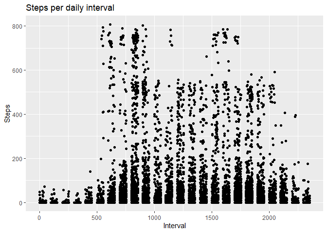

## Loading and preprocessing the data


```r
dta <- read.csv('C:\\Users\\eldmo\\Downloads\\repdata_data_activity\\activity.csv')
```

```r
library(tidyverse)
```

```
## -- Attaching packages --------------------------------------- tidyverse 1.3.1 --
```

```
## v ggplot2 3.3.5     v purrr   0.3.4
## v tibble  3.1.4     v dplyr   1.0.7
## v tidyr   1.1.3     v stringr 1.4.0
## v readr   2.0.1     v forcats 0.5.1
```

```
## -- Conflicts ------------------------------------------ tidyverse_conflicts() --
## x dplyr::filter() masks stats::filter()
## x dplyr::lag()    masks stats::lag()
```

```r
na.omit(dta$steps)
```

```
##     [1]   0   0   0   0   0   0   0   0   0   0   0   0   0   0   0   0   0   0
##    [19]   0   0   0   0   0   0   0   0   0   0   0   0   0   0   0   0   0   0
##    [37]   0   0   0   0   0   0   0   0   0   0   0   0   0   0   0   0   0   0
##    [55]   0   0   0   0   0   0   0   0   0   0   0   0   0   0   0   0   0   0
##    [73]   0   0   0   0   0   0   0   0   0   0   0   0   0   0   0   0   0   0
##    [91]   0   0   0   0   0   0   0   0   0   0   0   0   0   0   0   0   0   0
##   [109]   0   0   0   0   0   0   0   0   0   0   0   0   0   0   0   0   0   0
##   [127]   0   0   0   0   0   0   0   0   0   0   0   0   0   0   0   0   0   0
##   [145]   0   0   0   0   0   0   0   0   0   0   0   0   0   0   0   0   0   0
##   [163]   0   0   0   0   0   0   0   0   0   0   0   0   0   0   0   0   0   0
##   [181]   0   0   0   0   0   0   0   0   0   0   0   0   0   0   0   0   0   0
##   [199]   0   0   0   0   0   0   0   0   0   0   0   0   0   0   0   0   0   0
##   [217]   0   0   0   0   0   0   0   0   0   0   0   0   0   0   0   0   0   0
##   [235]   0   0   0   0   0   0   0   0   0   0   0   0   0   0   0   0   0   0
##   [253]   0   0   0   0   0   0   0   0   0   0   0   0   0   0 117   9   0   0
##   [271]   0   0   0   0   0   0   0   0   0   0   0   0   0   0   0   0   0   0
##   [289]   0   0   0   0   0   0   0   0   0   0   0   0   0   0   0   0   0   0
##   [307]   0   0   0   0   0   0   0   0   0   0   0   0   0   0   0   0   0   0
##   [325]   0   0   0   0   0   0   0   0   0   0   0   0   0   0   4   0   0   0
##   [343]  36   0   0   0   0   0   0   0   0   0   0   0   0  25   0   0  90 411
##   [361] 413 415 519 529 613 562 612 534 323 600 533 251  56   0  32  80  10   9
##   [379] 145  46   0  44 126  42 138  53   0   0  22  57 161  19  15   0  16   0
##   [397]   0   8   0  51 516 245   0 161   7   0   0   0   0   0   0   0   0   0
##   [415]   0   0   0   0   0   0   0   0   0   0   0   0   0  72  73   0   0 116
##   [433]  97   0   0   0   0   0  15   0   0   0   0   0  80  69   0   0   0   0
##   [451]   0   0   0  99 100   0   0  33   0   0   7   0   0   0   0   0   0   0
##   [469]   0   0   0   0   0   0   0   0   0  88 154   0  20   0   0   0   0   0
##   [487]   0   0   0   0   0   0   0   0 198  61  75   0   0 193 298   0  15  21
##   [505]   0   0   0   0  51  36   0  26  22   0  39  52  15  41   0  42   0   0
##   [523] 159  32   0   0   0   0  34   0   0   0   0  36  73   9   0   0   0   0
##   [541]   0   0   0   0   0   0  90 128  46   0   0   0   0   0   0   0   0   0
##   [559]   0   0   0   0   0   0   0   0   0   0   0   0   0   0   0   8   0   0
##   [577]  47   0   0   0   0   0   0   0   0   0   0   0   0   0   0   0   0   0
##   [595]   0   0   0   0   0   0   0   0   0   0   0   0   0   0   0   0   0   0
##   [613]   0   0   0   0   0   0   0   0   0   0   0   0   0   0   0   0   0   0
##   [631]   0   0   0   0   0   0   0   0   7  18  57  40   0   0   0   0  16   1
##   [649]   0  18  20  40  36  17  49  86  49   0  29  59   7  25  30  31   7  18
##   [667] 113 181  87   0   0   0  57  99 507 522 510 519 508 423 499 259  31  17
##   [685]   0   0   0   0   0  17   0 145 453 229 144   0   0   0  82   0   0   0
##   [703]   0   0   0   0   0   0   0   0   0   0   0 180  21   0   0   0   0   0
##   [721] 160  79   0   0   0  46  66 127   0   0   0   0   0   0  31   0   0   0
##   [739]   0   0  28 496  78   0   0   0   0   0   0   0   0  77  20   7   1 128
##   [757] 354 310   0   0  25  15   0   0   0   0  33  33  32  66  77   0  44   0
##   [775]   0   0   0   0   0   0   0   0   0   0   0  40   0  37  90  53  73  92
##   [793] 285 527 531 547 175 114  62   0  59  65   0 101  43   0   0   0  49  21
##   [811]   0  16  56   0   0   0   0   0   0   0   0   0   0   0  17  15   0   0
##   [829]  27 106 122  41  35   6   0   0  68   0   0   0   0   0   0   0   0   0
##   [847]   0   0   0   0   0   0   0   0   0   0   0   0   0   0   0   0   0   0
##   [865]   0   0   0   0   0   0   0   0   0   0   0   0   0   0   0   0   0   0
##   [883]   0   0   0   9  14   0   0   0   0   0   0   7   0   0   0   0  27   0
##   [901]   0   0   0   0   0   0   0   0   0   0   0   0   0  39   0   0   0   0
##   [919]   0   0   0   0   0   0   0  27   0   0   0   0   0   0   0   0   0  52
##   [937]  36   0   0  28  67 119   7  21  29  68  29   0  11  19  84  50   2  43
##   [955] 126  30  19   8 171  68 114   0   9 122 400 451 371 470 473 512 449 496
##   [973] 530 509 252  84  16   0   6  46  39   0   0   0   0   0   0   0   0   0
##   [991]   0   0   0   0   0   0   0   0   0   0   0   0   0   0   0   0   0   0
##  [1009] 138 541 555 345 345  10 485 515 168   0   0   0   0   0   0   0 349 341
##  [1027]   0   0   0   0   0 158 545  82   0 105   0   0   0   0   0   0   0   0
##  [1045]   0   0   0   0   0   0   0   0 326 172 332 402  70   0   0   0   0   0
##  [1063]   0   0   0   0   0   0   0   0   0  53   0   0   0   0   0   0   7  10
##  [1081]  65  40  15  29   0  20  35  69  25  46  15  26  33  58  75  59   0   0
##  [1099]   0   0   0   0   0   0   0   0   0   0   0   0   0  71   0   0   0   0
##  [1117]   0   0   0   0   0   0   0   0   0   0   0   0   0   0   0   0   0   0
##  [1135]   0   0   0   0   0   0   0   0   0   0   0   0   0   0   0   0   0   0
##  [1153]   0   0   0   0   0   0   0   0   0   0   0   0   0   0   0   0   0   0
##  [1171]   0   0   0   0   0   0   0   0   0   0   0   0   0   0   0   0   0   0
##  [1189]   0   0   0   0   0   0  40  11   0   0   0   0   0   0   0   0   0  19
##  [1207]  67   0   0   0   0   0   0   0   0   0   0   0   0   0  27   0   0   0
##  [1225]   0   0   0  36  50  38   0   4  42  14   8 135 172 124  31  52   0 104
##  [1243] 170  58   0   0  75   0   0 211 321 149   0  82  94 225 216 199  50 187
##  [1261]  30   0  65 173  43   0   0   0   0   0   0   0  16  26   0   0   0   0
##  [1279]   0   0   0   0   0   0   0   0   0   0   0   0   0  95  64   7  33  72
##  [1297] 221 439 519 440 394  97  71  10  87 443 500 465 485 351 515 511 506 486
##  [1315] 171  12  24  42 140  15   0  43  67  48   0   0   9  31  30  64 115  25
##  [1333]   0  27   0   0   0   0   0   0   0   0   0   0  27  27   0   0   9   0
##  [1351]   0  54  35   0  49   0   0   0   0  93   0   0  13   0   6  12   0   0
##  [1369]  34  77 173 370 402 504 485 437 526 264   0  35 124  93   0   0   0   0
##  [1387]   0   0   0   0   0   0   0   0  33 118   0   6   0 262  33  46  35   0
##  [1405]   0   0   0   0   0   0   0   0   0   0   0   0   0   0   0   0   0   0
##  [1423]   0   0   0   0   0   0   0   0   0   0   0   0   0   0   0   0   0   0
##  [1441]   0   0   0   0   0   0   0   0   0   0   0   7   0  36   0   0   0   0
##  [1459]   8   0   0  11   0   0   0   0   0   0   0   0   0   0   0   0   0   0
##  [1477]   0   0   0   0   0   0   0   0   0   0   0   0   0   0   0   0   0   0
##  [1495]   0   0  36   0   0   0   0   0   0   0   0   0   0   0   0   0   0   0
##  [1513]   0   0   0  34  13   7  71   0   0  10  29  19  30   0  43   0  99  66
##  [1531]   0   0  43  40  19  74 121  73   0  27  99  58  62   0   0   0   0   0
##  [1549]  23   0 223 312 106 284  88 124 102 230  78 207 281 247 235 334 389 414
##  [1567]  88   0   0   0   0  19   0  16   0   0   0  68  64   0 118  26   0  34
##  [1585]  18  34  28   0   0   0  37  40  35  53  15  12   0   0  16   0   0   0
##  [1603]  44   0   0   0   0   0   0   0   0   0   0  11  11   0   0   0   0   0
##  [1621]   0   0   0   0   0   0   0   0   0  80   0   0   0   0  12  25  30  50
##  [1639]   0  83  13 146 422 453 411 439 523 413  13 165   0  79   7 142 107   0
##  [1657]  90  17  18  61   0   0   0  80 190  82  51  30  23  51  31   0   7  49
##  [1675]   0   0   0   0   0   0   0   0  42 175 170   0 290   0   0   0  36   0
##  [1693] 117  72  52   8   0   0   0   0   0  61   0   0   0   0   0   0   0   0
##  [1711]   0   0   0   0   0   0   0   0   0   0   0   0   0   0   0   0   0   0
##  [1729]   0   0   0   0   0  13  28   0   0   0   0   0   0   0   0   0   0   0
##  [1747]   0   0   0   0   0   0   0   0  56   0   0   0   0   0   0   0   0  50
##  [1765]   0   0   0   0   0   0   0   0   0   0   0   0   0   0  57   0   0   0
##  [1783]   0   0   0   0   0   0   0   0   0   0   0   0   0   0   0   4   0   0
##  [1801]   0   0   0   8   0  13  45  25  28  15  34  63  18  62  22   0  26  19
##  [1819]   0  10  22  18 161 146  26 257 748 743 727 393 667 635 732 613 530 655
##  [1837] 134   0   0  32  75 182   0   6   0  41   0   0  23   0  35 526   0   0
##  [1855] 133  45   0   0   0  57   0   0   0   0   0   0   0   0   0   0   0  38
##  [1873] 211 279  19  20  19   0   0   0   0   0   0   0   0   0   0   0   0   0
##  [1891] 247 196 108 137   0   0   0  10   0   0   0   0   0   0   0   0   0   0
##  [1909]   0   0   0   0   0   0   0   0   0  76   0   0   0  61  58   0   0   0
##  [1927]   0   0   0   0  43   3   0   7  34  46 336 283   0   7   0   0   0   0
##  [1945]   0   0  75  82   0  33  24  61  16  76  33   0   0  57   0   0   0   0
##  [1963]   0   0   0   0   0   0   0   0   0  81  48   0   0   0   0   0   0   0
##  [1981]  31  15 138  88   0  14  36 102  14 279 153   0   0 109   0   0   0  14
##  [1999]  16   0   0   0   0   0   0   0   0   0   0   0   0   0   0   0   0  20
##  [2017]  34  18   7   0   0   0   0   0   0   0   0   0   0   0   0   0   0   0
##  [2035]   0   0   0   0   0   0   0   0   0   0   0   0   0   0   0   0   0   0
##  [2053]   0   0   0   0   0   0   0   0   0   0   0   0   0   0   0   0   0   0
##  [2071]   0   0   0   0   0   0   0  34   0   0   0   0   0   0   0   0   0   0
##  [2089]   0   7   9  36   0  47  67   0  49  23  15  29  42  49  92  28  33  63
##  [2107]  97  90 101  55  75  40  47  22  61   0   0   0   0   0   0  60  54  16
##  [2125] 135  61  69  32   0   0  17   0   0  69   0  20 400 105 292 291  30   0
##  [2143]   0  40  38   0   0   0   0   0   0  72  37   0   0  25  17   0   0  88
##  [2161]   7 413 326  93 334 317   0   0   0   0  68 129   0   0   0   0   0   0
##  [2179]   0   0   0   0   0   0   0   0 103 119   0   0   0  70 125   0   0   0
##  [2197]   0   0   0   0   0   0 176  71  43 340   7  13  15   0   0   0   0   0
##  [2215]   0   0   0   0   0  15  50 271 106 272 308   0   0 111 281  11 139  36
##  [2233]   0   0   0   0   0   0  58  63 260  82 310   0   0   0   8  12 364 219
##  [2251]   0   0   0 174 205  12   0   0  11  17   0   0  37   0   0 105  34   0
##  [2269] 152   0   0   0   0   0   0   0   0   0   0   0   0   0   0 112  23  12
##  [2287]   8   0   0   0   0   0   7   0   0   0   0   0   0   0   0   0   8   0
##  [2305]   0   0   0   8   0   0   0   0   0   0   0   0   0   0   8   0   0   0
##  [2323]   0   0   0   0   0   0   0   0   0   0   0   0   0   0   0   0   0   0
##  [2341]   0   0   0   0   0   0   0   0   0   0   0   0   0   0   0   0   0   0
##  [2359]   0   0 139  15   0   0   0   0   0   0   0   0   0   0   0   0   0  11
##  [2377]   0  10  40   0   0  32  34 105  33   8  16  18   0   9   0   0  27  22
##  [2395]   0  50   0   0   0  23  43  70 619 743 446 748 424 747 739 741 726 166
##  [2413] 548 343  13  26  64   0   0   0   0   0   0   0   0   0   0   0   0   0
##  [2431]   0   0   0   0   0   0   0   0   0   0   0   7  46   0   0   0   0   0
##  [2449]   0   0   0  31  45   0   0   0   0   0   0   0   0   0   0   0   0   0
##  [2467]   0   0   0   0   0   0   0   0   0   0   0   0  22  27   0   0   0   0
##  [2485]   0   0   0   0   0   0  75 119 395  78 292 416  35   0   0  27  32   0
##  [2503]   0   0   0   0  49  57  34   0   0   0   0   0  39  30   9  41   7   0
##  [2521]   0  40  22  31  19   0   8  22  62  60   0   0   0   0   0   0   0   0
##  [2539]   0   0   0   0   0   0   0   0   0   0   0   0   0   0   0   0   0   0
##  [2557]   0   0  95   0  91  50  31   0   0   0  20  11   0   0   0   0   0   0
##  [2575]   0   0   0   0   0   0  11   0   0   0   0   4   0   0   0   0   0   0
##  [2593]   0   0   0   0   0   0   0   0   0   0   0   0   0   0   0   0   0   0
##  [2611]  38   0   0   0   0   0   0   0   0   0   0   0   0   0   0   0   7   0
##  [2629]   0   0   0   0   0   0   0   0   0   0   0   0   0   0   0   0   0   0
##  [2647]  48   0   0   0   0   0   0   0   0   0   0   0   0   0  30  92   0  11
##  [2665]   0  10  19 111  38  16  29   9  45  35  53  43   8  40   0  32  57  35
##  [2683] 117 117  25  95  29 141  51 123 440 687 614 474 750 742 770 735 746 748
##  [2701] 802 280  31   0   0   0   0   0   0   7  92   0   0   0   0   0  46   7
##  [2719]   0 328 156   0   0   0 129 339 150   0   0   0  70   0   9   0   0   0
##  [2737]  70   0   0   0   0   0   0   0  18  91   0   0   0  75   0   0   0   0
##  [2755]  99   0   0   0   0  96  16  20 144 321 267   0   0   0   0   0   9   0
##  [2773]   0  24  78   0  26  35   0   0   0 365  90 432 275  34   0  92  15   0
##  [2791]   0   0   0  20  10   9   0   0  32  24   0   0  38  40  19  71   2  21
##  [2809]   0 433 463 511 298 500 473 506  24  35  41  46   0   0   0  16  23   0
##  [2827]   0   0  18  54  36   0   0   0   0   0   0   0   0   0   0  18  30  23
##  [2845]  70 113   0   0   0   0   0   0   0   0   0   0   0   0   0   9   0   0
##  [2863]   8   0   0   0   0   0   0   0   0   0   0   0   0   0   0   0   0   0
##  [2881]   0   0   0   0   0   0   0   0   0   0   0   0   0   0   0   0   0   0
##  [2899]   0   0   0   0   0   0   0   0   0   0   0   0   0   0   0   0   0   0
##  [2917]   0   0   0   0   0   0   0   0  10   0   0   0   0   0   0   0   0   0
##  [2935]  24  29   0   9  33   0   0   0   0   0   0   0   0   0   0   0   0  39
##  [2953]   0   0   0  55   0   0   0  69  26  12  28   0   0   0  32   0   0   6
##  [2971]  52  32   8  88   0   0  73   0   7   0  24 103  23  67 248 512 542 265
##  [2989]  18 497 476 479 491 504 488 498  55 120  57   0   0   0   0   0  15  29
##  [3007]  88   0   0  22   0  69  22   0  20  80   6  79   6  79   0   0   0   0
##  [3025]  23  74 335 429  64   0   0   0   0  81  38   9   0   0   0   0   0   0
##  [3043]   0  11  38 139 532 507 210 276 518 495 214  98 161   0   0   0  12 120
##  [3061] 194   0   0 114   7   0  34   0   0  18  31  15   0   0  18  39  66 111
##  [3079]   7   0   0  71  41   0   0   0   0   0   0   0   0   0   0   0   0  20
##  [3097]  43  23   0  25  54   0  19   0   0   0   0   0   9  28   8   0  48  64
##  [3115]   0   0  67  29   0   0   0   0   0  36  22   0   9   0   0   0  29 129
##  [3133]   0   0   0   0   0   0   0   0   0   0   0   0   0   0   0   0   0   0
##  [3151]   0   0   0   0   0   0   0   0   0   0   0   0   0   0   0   0   0   0
##  [3169]   0   0   0   0   0  52   0   0   0   0   0   0   0   0   0   0   0   0
##  [3187]   0   9   0   0   0   0   0   0   4   0   0   0   0   0   0   0   0   0
##  [3205]   0   0   0   0   0   0   0   0   0   0   0   0   0   0   0   0   0   0
##  [3223]   0   0   0   0  45   0   0   0   0   0   0   0   0   0   0   0  18  41
##  [3241]   0   0   0   0   0  20  16  37   0   0   0  13   0   0  14  21   0  59
##  [3259]   0  28  62  28  15   0   0   0   0  25  63   0   0  52  23   0   0  87
##  [3277]  15   0  59  15   0   0   0  19   0  59  78 221 392 468 475 524 507 528
##  [3295] 533 540 540  65  48  46 143   0  79   0   0   0   0   0   0   0   0   0
##  [3313]   0   0   0   0   0   0   0   0   0   0   0   0  17   0   0   0   0   0
##  [3331]   0   0   0   0   0   0  44  32   0   0  38  17   4  59  78   0   0   8
##  [3349]  10  82 120 232 505 498 298 330 486 533 298 285 250 223 302 465 520 526
##  [3367] 535 247 400  72   0   0   0   0   0   0 432  85  39  55   0  17  30  43
##  [3385]   0   0   0   0  63  58  49  16   0  65   0 153  73   1   0   0   0   0
##  [3403]   0   0   0   0   0   0   0   0   0   0   0   0   0   0   0   0   8  95
##  [3421] 157  22   0   0   0   0  37   0   0   0   0   0   0   0   0   0   0   0
##  [3439]   0   0   0   0   0   0   0   0   0   0   0   0   0   0   0   0   0   0
##  [3457]   0   0   0   0   0  35   0   0   0   0   0   0   0   0   0   0   0   0
##  [3475]   0   0   0   0   0   0   0   0   0   0   0   0   0   0   0   0   0   0
##  [3493]   0   0   0   0   0   0   0   0  16   0   0   0   0  11  24   0   0   0
##  [3511]   0   0   0   0   0   0   0   0   0   0   0   0   0   0   0   0   0   0
##  [3529]  10   0   0   0  54   0  20   0  90   0   7   0  54  20   0   0   0  64
##  [3547]  24   0  68  43  43  81  35 133  99  22  75  72 224 786 315 264 781 757
##  [3565] 732 686 592 119 127  21  35   0   0  78   2   0   0   0   0   0   0   0
##  [3583]   0   0   0   0   0   0   0   0   0   0   0   0   0  38  37 193  25   0
##  [3601]   0   0  29  71  73   8   6  38   0   0   0   0   0   0   0   0   0   0
##  [3619]   0   0   0   0   0   0   0   0   0   0   0   0   0   0   0   0   0   0
##  [3637]   0  64  82   0   0   4   0   0   0   0   0  19   0   0  58  94   0   0
##  [3655]   0   0   0   0   0   0   0   0   0   0   0   0   0   0   0   4   0   0
##  [3673]  30   0   7   0  32  54  83   0 203 581  55 310 437   0  46   0   0  50
##  [3691]   0   0   0   0   0   0   0   0   0  65   0   0   0   0   0   0   0   0
##  [3709]  22   8   0   9   0   0 152 406  86   0   8  17   0   0   0   0   0   0
##  [3727]   0   0   0   0   0   0   0  16   0   0   0   0   0   0   0   0   0   0
##  [3745]   0   0   0   0   0   0   0   0   0   0   0   0   0   0   0   0   0   0
##  [3763]   0   0   4   0   0   0   0   0   0   0   0   0   0  12   0   0   0   0
##  [3781]   0   0   0   0   0   0   0   0   0   0   0   0   0   0   0   0   0   0
##  [3799]   0   0   0   0   0   0   0   0  12   0   0   0   0   0   0   0  12   0
##  [3817]   0  17   0   0   0   0  58 178  15  55  55  83  29  57  13  38 166  65
##  [3835]  86  58 135 119   0  80 146  89 317 758 750 721 697 743 755 737 495 385
##  [3853]  36  31  71   0  56 100   0   0   0  29   0   0   0   0  16 433 143   7
##  [3871] 232   0   0   0   0  46   0   0   0   0   0   0   0   0   0   0   0   0
##  [3889]   0   0  36   0  16  92  96   0  56   0  21 308 120   0   0   0   0  81
##  [3907]  11  57   0   0   0   0   0   0  28  41 179 143  13   0   0   0   0   0
##  [3925]   0 211   0 168   0   8   0   0   0   0   0   0   0   0   0   0   0   0
##  [3943]   0   0  10   0   0   0 260 464   0  15   7  20   0   0  15   0   0   0
##  [3961]  86  24  26  19  17   0  26 107 513 318 325 467 494 426  70  67  45  39
##  [3979]  60  19  63  39   0   0   0   0   0   0   0   0   0   0   0   0  88   0
##  [3997]   0   0   0   0   0   0   0   0   0   0   0   0   0   0   0   0  74   0
##  [4015]   0   0   0   0   0   0   0   0   0   0   0   0  56   0   0   0   0   0
##  [4033]   0   0   0   0   0   0   0   0   0  72   8   0  17   0   0   0   0   0
##  [4051]   0   0   0   0   0   0   0   0   0   0   0   0   0   0   0   0   0   0
##  [4069]   0   0   0   0   0   0   0   8   0   4   0   0   5   0   0   0   0   0
##  [4087]  43   0   0   0   0   0   0   9  39   0   0   0   0   0   0   0   0   0
##  [4105]   0   0   0   8  43   0   0   0  33   0  17  31  45  23  35   0  37 127
##  [4123]   7  10   0  26  66  74 540 364 344 652 680 680 744 720 701 266   0 103
##  [4141] 668 101   0   0   0   0   0   0   0   0   0   0  92   0   0   0   0  16
##  [4159]   0   0   0   0   0   0   0  16  17 199 429   0 186 160   0   0   0   0
##  [4177]   0   0   0   0   0 143  86   0   0   0   0   0  30   0   0   8   0 285
##  [4195] 146   3   0   0   0   0   0   0   0   0   0   0   0   0   0   0 241  11
##  [4213]   0   0   0   0   0  80   0   0   0   0  86  48  28   0   0   0   0   0
##  [4231]   0   0   0   0   0 137  40   0   0  63 163 408 153   0  12   0   8   0
##  [4249]   0   0   0 115  31  52  60   0   0  42 178 479 297 371 483 319  26  14
##  [4267]  79   0   0   0  47   0   0   0   0   0   0   0   0   0   0   0   0   0
##  [4285]   0  88  68   6   0   0   0   0   0   8   0   0   0   0   0   0   8   0
##  [4303]   8   0   0   0   0   0   0   0   0   0   0   0   0   0   0   0   0  29
##  [4321]   0   0   0   0   0  11   0   0   0   0   0   0   0   0   0   0   0   0
##  [4339]  42   0   0   0   0   0   0   0   0   0   0   0   0   0   0   0   0   0
##  [4357]   0   0   0   0   0   0   0  12   0   0   0   0   0   0   0   0   9   0
##  [4375]   0   0   0   0  68   0   0   0   0   0   0   8   0   0   0   0   0  11
##  [4393]   0   0   0  20   0  65  22   0   0  33  32  81  62   0  12  68   0   0
##  [4411] 114  20   0   0   0   0 105  48 619 759 735 618 446 757 608 568 571 355
##  [4429]  55  32  79  49   0   0   0   0   0   0   0   0   0   0   0   0   0   0
##  [4447]   0   0   0   0   0   0   0   0   0   0   0   0   0   0   0   0   0   0
##  [4465]   0   0   0 193  37   0   0   0   0   0   0   0   0   0   0   0   0   0
##  [4483]   0   0   0   0   0   0   0   0   0   0   0   0   0  63   4   0   0   0
##  [4501]   0   0   0   0   0   0   0  64 468 127 504 286  44  61  27   0   0   0
##  [4519]   0   0   0   0   0   0   0   0   0   0   0   0   0   0   0  21 106   0
##  [4537]   0 163   0 168   0 111   8   8  26  20   0  21   0 168  42   0   0   0
##  [4555]   0   0   5   0  62  17   0   0   0   0   0   0   0   0   0   0   0   0
##  [4573]   0   0   0   0   0  23  43   0   0   0   0   0  50   0  17   5   0   0
##  [4591]   0   0   0   0   0   0   0   0   0   0   0   0   0   0   0   0   0   0
##  [4609]   0   0   0   0   0   0   0   0   0   0   8   0   0   0   0   0   0   0
##  [4627]   0   0   0   0   0   0   0   0   0   0   0   0   0   0   0   0   0   0
##  [4645]   0   0   0   0   0   0   0   0   0   0   0   0   0   0   0   0   9   0
##  [4663]   0   0   0   0   5   7   0   0   0   0   0   0   0   0   0   0   0   0
##  [4681]   0   0  20   0   0   0  16   0 149   0   0  31  17   0   0   0  20   0
##  [4699]   0  62 182  15  54   6  66  12 156   0  32 158  33   0   0   0   0   0
##  [4717]  15   0  95 511 186   0   0   0   0 193 108   0   0   0   0   0   0   0
##  [4735]   0   0 160  43 257  31   0   0   0   0 152 362 167 290   0   0   0   0
##  [4753]   0 121 303  52  11 260  77   0   0  77 137   0   0   0   0   0 146 428
##  [4771]   0   0   0 143   0  74   0   0   0   0   0   0   0   0   0   0   0   0
##  [4789]   0   0   0  86   0   0 351 236 128  80   0  62   0 258 311   0   0   0
##  [4807]  30   9 282 476 168 415  88   0  19   0   0   0   0   0  85   0  28  71
##  [4825]  28  19 391 494 299 512 482  74  56   0   9   0   7  25   0   0   0   0
##  [4843]  46  66  62   1 200  86  51  58   0   0  24   0  33   0   0   0   0   0
##  [4861]   0   0   0   0   0   0   0   0   0   0   0   0  10  30  97   0   0  21
##  [4879]   0   0   0   0   0   0   0   0   0   0   0   0   0   0   0   0   0   8
##  [4897]   0   0   0   0   0   0   0   0   0   6   0   0   0   0   0   0   0   0
##  [4915]   0   0   0   0   0   0   0   0   0   0   0   0   0   0   0   0   0   0
##  [4933]   0   0   0   0   0   0   0   0   0   0   0   0   0   0  51   0   0   0
##  [4951]   0   0   0   0   0   9   0   0   0   0   0  53   0   0   0   0   0   7
##  [4969]   0   0   0  73   7   0   0   4   0   0   0   0   0   0   0   0   0   0
##  [4987]   0   0   0   0   0   0   0   0   0   0   0   0   0   0   0   0   0   0
##  [5005]   0   0  33  61   0   0  24  48   0   0  42  21   0   0   0   0   0   0
##  [5023]   0   0  85  30   0   0   0  13   0   0  22  11   0  69  75 128   6   0
##  [5041]   0   0   0 129  63 133  49  13   0   0   0  53  21   0   0   0   0  19
##  [5059]  71   0   0   0   0   0   0   0   0  44  35  44   0 137   0   0   0   0
##  [5077]   0   0   0   0   0   0   0   0   0   0  28  87  53   0   0  32  26   0
##  [5095]   5  30 122  92   0  19   0   0   0   0   0   0   0   0  38   0   0   0
##  [5113]   0 135 142  16   0   0  16  38  78  12  75  34 112 119  43   0  53  36
##  [5131]  19   0  32 508 439 529 489 528 473 516 480 532 529 529 517 489 453  56
##  [5149]  38  52   0   0   0   0   0  23   9   0   0   0   0   0   0   0   0  25
##  [5167]   0   0   0   0   0   0   0   0   0   0   0   0   0   0   0   0   0   0
##  [5185]   0   0   0   0   0   0   0   0   0   0   0   0   0   0   0   0   0   0
##  [5203]   0   0   0   0   0   0   0   0   0   0   0   0   0   0   0   0   0   0
##  [5221]   0   0   0   0   0   0   0   0   0   0   0   0  58   0   0   0   0   0
##  [5239]   0   0   0   0   0   8   0   0   0  34   0   0   0   0   0   0   0   0
##  [5257]   0   0  19  74   1  11   0  48  24  16   0   7  15  77  52  23   0  49
##  [5275]   0  51   0   0   0   0   0   0   0   0  25   8  32  14  85   0  21   0
##  [5293]   0   0   0   0  75  56 132   0   0   0   0   0   0   0   0   0   0   0
##  [5311]   0   0   0   0  49  17  98 122  35  59 179 203 117   0  43   6  91  88
##  [5329]  61  64  18   0   0   0   0  54   0  46 184   0   0   0   0   0  36   0
##  [5347]   0   0   0  18  14 309 119   0   0   0   0   0   0   0   0 188 361   0
##  [5365]  19 305 462 384 395 451 223 260  14   0   0   0  30   7   0   0   0   0
##  [5383]  16   0   0   0  74  22 110   7   0   0  25  48  69  62  40   0   0   0
##  [5401]   0  31   0  51  24  33   0  41   0   0   0   0   0   0   0   0   0   0
##  [5419]   0   0   0   0   0   6  12 219  94 457 501 454 184  20  35  18  15   0
##  [5437]   0   0   0   0   0   0   0   0   0   0   0   0   0   0   0   0   0   0
##  [5455]   0   0   0   0   0   0   0   0   0   0   0   9   0   0   0   0   0   0
##  [5473]  10   0   0   0   0   0   0   0   0   0   0   0   0   0   0   0   0   0
##  [5491]   0   0   0   0   0   0   0   0   0   0   0   0   0   0   0   0  38   0
##  [5509]   0   0   0   0   0   0  38   0   0   0   0   0   0   0   0   0   0   0
##  [5527]   0   0   0   0   0   0   0   0   0   0   0   0  13   0   0   0   0  70
##  [5545]  19   0   0  32 102   0   0   0  38   0  76  43   0  14  33  16  23   8
##  [5563]  16   0   0  49  34  29  48  47 122  13 255   0  64  25 162  31  63   0
##  [5581]  71   3   0   0  18 540  38   0   0   0   0   0   0   0   0   0   0   0
##  [5599]   0   0   0   0   0   0  95  29  96 107  45  52 527 729 783 756 715 713
##  [5617] 283  81  85 489 136 141 519   7   8 109   0   0   0   0   0   0   0   0
##  [5635]   0   0   0   0   0   0   0   0   0   0   0   0   0   0   0   0   0   0
##  [5653]   0   0   0   0   0   0   0   0   0   0   0   0   0   0   0   0   0   0
##  [5671]   0   0   0   0   0   0   0   0   7  80 160 403 263 411 375 465 472 487
##  [5689]  27   0   0  39  24   0  33  32  33  10 136  38   0   0  14  41   0   0
##  [5707]   0   0   0   0   0  19  23   0   0   0   0   0   0   0   0   0   0   0
##  [5725]   0   0   0   0   0   0   0   0   0   0   0   0   0   0   0  77 174 389
##  [5743] 396  62   0   6  58   0   0   0   0   0   0   0   0   0   0   0   0   0
##  [5761]   0   0   0   0   4   0   0   0   0   0   0   0   0   0   0   0   0   0
##  [5779]   0   0   5   0   0   0   0   0   0   0   0   0   0   0   0   0  10   0
##  [5797]   0   0   0   0   0   0   0   0   0   0   0   0   0   0   0   0   0   0
##  [5815]   0   0   0   0   0   0   0   0   0   0   0   0   0   0   0   0   0   0
##  [5833]   7   0   0   0   0   0   0   0   0   0  10  12  38   0  27  18  56  12
##  [5851]  96   7  27   4  40  84   0 190  79  15   0   0  19   0  28  20   0  62
##  [5869] 400 189   9 192  42   0   0   0   0  27  70   0   0   0   0   0   0   0
##  [5887]   0   0   0   0   0   0 260 182   8  66   0   0  62 114  20  19   0 156
##  [5905] 499  64 376 209   0   0   0   0   0   0  13 346  50  40   0   0   0   0
##  [5923]  17   7   0   0  79  95  50  71   0   0   0   0   0  16 124   0   0   0
##  [5941] 109   0   0   0 139  56 110   0  75 276   0   0 154   0   0   0   0   0
##  [5959]   0   0   0   0  36 116  11   0   8 120   0   0 237 198 304   0   0 154
##  [5977]   0   0   0   0   0   0   0   0   0   0   0   0   0   0   0   0   0   0
##  [5995]  33 451 432 146 483 201   0   0  46   7   0   0   0  17  61   0   0   0
##  [6013]   0   0  62  28   0   0   0   0   0   0   0   0   0   0   0   0  18   0
##  [6031]  26  55   0   0   0   0   7   0   0   0   0   0   0   0   0   0   0   0
##  [6049]   0   0   0   0   0   0   0   0   0   0   0   0   0   0   0   0   0   0
##  [6067]   0   0   0   0   0   0   0   0   0   0   0   0   0   0   0   0   0   0
##  [6085]   0   0   0   0   0   0   0   0   0   0   0   0   0   0   0   0   0   0
##  [6103]   0   0   0   0   0   0   0   0   0   0   0   0   0   0   0   0   0   0
##  [6121]   0   0   0   0   0   0   0   0   0   0   0  83   0  32  18   0  60   0
##  [6139]   0   0 105  29  15  49  43   4 111   0   0   0   0   0   0   0   0   0
##  [6157]   0   0  90  18   0   0  19  16   0   0  14   0   0   0   0   0 137 323
##  [6175] 286   0   0 171 173  84   5   0   0   0   0   0   0   0   0   0   7   0
##  [6193]   0 124 135   0   0   0   0   0   0   0   7 261   0   0   0   0   8   0
##  [6211]   0   0   0   0   0   0   0   0 159   0  26 350 274   0   0  19  82   0
##  [6229]   9   0   0  52  51   0  20 130 334 156 506  59   0   0   0  25  21   0
##  [6247]   0   0   0   0   0 117   0   0  18  26   0   0   0   0   0   0   9  42
##  [6265]  42  44  94  80   0  53 103  70  93 413 524 410 533 311  38  46  77  58
##  [6283]   0   0  48   0  38   0  40  15   0  37   0   0   0   0   0   0   0   0
##  [6301]   0  42  23  74   0   0  21   0   0   0   0   0   0   0   0  62   0   0
##  [6319]   0   0   0   0   0   0   0   0   0   0   0   0  27  27   0   0   0   0
##  [6337]   0   0   0   0   0   0   0  46   0   0   0   0   0   0   0   0   0  59
##  [6355]   9   0   0   0   0   0   0   0   0   0   0   0   0   0   0   0   0   0
##  [6373]   0   0   0   0   0   0   0   0   0   0   0   0   0   0   0   0   0   0
##  [6391]   0   0   0   0   0   0   0   0   0   0   0   0   0   0   0   0   0   0
##  [6409]   0   0   0   0   0   0   0   0   0   0   0   0   0   0   0   0   0   0
##  [6427]   0   0   0  11 109  25   0   0   0   0  78   8   0   0   4   0   0   0
##  [6445]   0   0   0   0   0   0   0   0   0   0   0   0   0   0   0   0   0  48
##  [6463]   0   0   0   0   0   0   7   0  51   0  52   0   0   0   0   0   0   0
##  [6481]   0   0   0   0   0   0   0   0   0   0   0   0   0   0   0   0 103   0
##  [6499]   0   0  59  26   0   0   0   0   0   0   0   0   0   0   0   0   0   0
##  [6517]   0   0   0   0   0   0   0   0   0   0   0   0   0   0   0   0  31  25
##  [6535]  31   0   0   0   0   0   0   0   0   0   0   0   0   0   0  21   0  10
##  [6553]   0   0   0   0   0   0  39   0  81  76  24  45  47  28   9   0  20  52
##  [6571]  18   0   0  54 443 399  22   0   0  41   0   0  68   0   0   0   0   0
##  [6589]   0   0   0   0   0   0   0   0   0   0   0   0   0   0   0   0   0   0
##  [6607]   0   0   0   0   0   0   0 101   0  24  51  16   0   0  17   0   4   0
##  [6625]   0   0   0   0   0   0   0   0   0   0   0   0   0   0   0   0   0   0
##  [6643]   0   0   0   0   0   0   0   0   0   0   0   0   0   0   0   0   0   0
##  [6661]   0   0   0   0   0   0   0   0   0   0   0   0   0   0   0   0   0   0
##  [6679]   0   6  10  20  14   0   0  13 101  67  37   0   0  15  27  40   0   0
##  [6697]  55  23  69  30   0   0  10   0   0  32  14  54   0  14  12  11   0   0
##  [6715]   0   0 134 170 153 167  78  34   0   0   8  13  15  34  16 203 440  56
##  [6733] 164 159   0   0   0   0   0   0   0   0   0   0   0   0   0  55  22   0
##  [6751]   0   0   0  41  17 306   0   0   0   0   0   0  46 313  20   0   0   0
##  [6769]   0   0  28 225   0   0   0  21   0   0   0   0   0   0   0  11   0   0
##  [6787] 131  80  39   0  77 111 412 194   0  15  17   0  22   0   0 242 128   0
##  [6805] 110  39   0  31 105   0   0   0   0   0   0   0   0  19   0   0   0   0
##  [6823]   0   0   0   0   0   0   0   0   0   0   0   0  25   0   0   0   0   0
##  [6841]   0   0  28  19  51   9   0 257 112 357  60  15  74  76   0  35  32  29
##  [6859]   0   0   0   0   0   0  36   0   7  65   0   0   0   0   0   0   0   0
##  [6877]   0   0   0   0   0   0   0   0   0   0   0   0   0   0   0   0   0   0
##  [6895]   0   0   0   0  18  63  15   0   0   0   0   0   0   0   0   0   0   0
##  [6913]   0   0   0   0   0   0   0   0   0   0   0   0   0   0   0   0   0   0
##  [6931]   0   0   0   0   0   0   0   0   0   0   0   0   0   0   0   0   0   0
##  [6949]   0   0   0   0  11   0   0   0   0   0   0   0   0   0   0   0   0   0
##  [6967]   0   0   0   0   0  16   0   0   0   0   6   0   0   0   0   0   0   0
##  [6985]   0   0   0   0   0   0   0   0   0   0   0   0   0   0   0   0   0   0
##  [7003]   0   0   0  19  50  11  56   0   0  62  40 132 505 544 345 446 366 527
##  [7021] 519 489 549 555 179   0   0   0  10  19   2   0   0  31   0   0   0   0
##  [7039]   0   0   0   0   0   0   0   0   0   0  39   0   0   0   0   0  34  47
##  [7057]  40  42   6  22  78  41  54  38   0   0  74 314  98 107   0 180 114  16
##  [7075]   0   0   0  72 155 135 136 120  30   0 150 149 373 166   0   0   0 108
##  [7093]   0   0  66   0   0   0   0   0   0   0   0   0   0   0   0   0   0   0
##  [7111]   0   0   0   0   0   0   0   0   0   0   0   0   0  46 148  60   0  76
##  [7129] 183 185  47 178  22   0  74  72  60  38   6   0   0  43   0   0   0   0
##  [7147]   0   0   0   0   0  48   0   0   0   0   0   0   0   0   0   0   0   0
##  [7165]   0   0   0   0   0   0  42  82 108   0 108   0   0   0   0   0   0   0
##  [7183]   0   0   0   0   0   0   0   0   0   0   0   0   0   0   0   0   0   0
##  [7201]   0   0   0   0   0   0   0   0   0   0   0   0   0   0   0   0   0   0
##  [7219]   0   0   0   0   0   0   0   0   0   0   0   0   0   0   0   0   0   0
##  [7237]   0   0   0   0   0   0   0   0   0   0   0   0   0   0   0   0   0   0
##  [7255]   0   0   0   0   0   0   0   0   0   0   0   0   0   0   0   0   0   0
##  [7273]   0   0   0   0   0   0   0   0   0   0   0   0   0   0   0   0   0   0
##  [7291]   0   0   0   0   9 109 208 203 472 533 380 156 475 489 406 513 522  92
##  [7309]  23  67 148   0   0   0   0   0   0   0  46   0   0   0   0   0   0   0
##  [7327]   0   0   0   0   0   0   0   5 100 149   0   0   0  86  48  89  79  51
##  [7345]  57  96  20 144 128  22   0  60   0  52  32  58  56  65  55  48  50 137
##  [7363]   0   0 204 289 115 174   0 208 100 148   0  46  23 154  55   0  22   0
##  [7381]   0   0   0   0   0   0   0   0   0   0   0   0   0   0   0   0   0   0
##  [7399]   0   0   0   0   0   0   0  62   0  39  79  71 501 158  50  24   0   0
##  [7417]  69  47  53   0  36  67  60   5   0  76   8  91  21  24  35 135 166   0
##  [7435]  32 171  10  17  21  31  25  38  22  30  17   0  75  44 138  81  27   0
##  [7453]   0   5   2 172  16  18 148 101   0  57   0   0   0   0   0   0   0   0
##  [7471]   0   0  17   0   9 181   0   0   0   0   0   0   0   0   0   0   0   0
##  [7489]   0   0   0   0   0   0   0   0   0   0   0   0   0   0   0   0   0   0
##  [7507]   0   0   0   0   0   0   0   0   0   0   0   0   0   0   0   0   0   0
##  [7525]   0   0   0   0   0   0   0   0   0   0   0   0   0   0   0   0   0   0
##  [7543]   0   0   0   0   0   0   0   0   0   0   0   0   0   0   0   0   0   0
##  [7561]   0   0   0   0   0   0   0   0   0   0   0   0   0  13  14  51   0   0
##  [7579]  76 167 401 397  35  36  12  16  32  23  67   0  40  56  64 117   0   0
##  [7597]   4   0   0   0   0   0   0   0   0   0   0 129 104   0   0   0   0   0
##  [7615]   0   0   0   0   0   0   0   0   7   0   0   0   0   0   0  13  20   0
##  [7633]   0   0   0  59   0   0   0   0   0  13   0   0   0   0   0   0  25   0
##  [7651]   0   0   0   0   0   0 104  59   0   0   0   0   0  20   0   0   0   0
##  [7669]   0   0   0   0   0   0   0  56   0   0   0   0   0   0   0   0   0  44
##  [7687]   0   0   0   0   0   0   0   0   0   7  49  53  20 113  13  79 128 108
##  [7705]  62   8  39  60  75 174  60  59  82  37   0   0   0  78   0   0   0   0
##  [7723]   0   0   0   0   0   0   0   0   0   0   0   0   0   0  59 194 591 349
##  [7741]  44   0  64  32  45  18   0   0   0   0   0  44   0   0   0   0   0   0
##  [7759]   0   0   0   0   0   0   0   0   0   0   0   0   0   0   0   0   0   0
##  [7777]   0   0   0   0   0   0   0   0   0   0   0   0   0   0   0   0   0   0
##  [7795]   0   0   0   0   0   0   0   0   0   0   0   0   0   0   0   0   0   0
##  [7813]   0   0   0   0   0   0   0   0   0   0   0   0   0   0   0   0   0   0
##  [7831]   0   0   0   0   0   0   0   0   0   0   0   0   0   0   0   0   0   0
##  [7849]   0   0   6  41   0  33  61   0  54  69   0   0  11  81  39  22   0  31
##  [7867]   0 178  33 137  25  28  15  25   0  75   0   0   0   0   0   0   5   0
##  [7885]   0   0   0   0   0   0   0   0   0   0   0   0   0   0   0   0   0   0
##  [7903]   0   0   0   0   0   0   0   0   0   4  21  27   0   0   0   0   0   0
##  [7921]   0   0  58   0   0   0   0   0   0   0  29  13  17  35 105  28  20  66
##  [7939]  10 100  48  32   0  56 137 364 477 509 213 281   0   0  22 440 468 432
##  [7957]  50   0  22   0  37  60  12   0  40  33   0   0   0   0   0   0   0   0
##  [7975]   0   0   0   0   0   0  32   0   0  24  60  27  96  35  78   0  37   9
##  [7993]   0  17  37  48  39 119 515 523 488 425 495 129  72  71  20   0  65   0
##  [8011]   0  35  25  31   0   0   0   0   0   0   0   0   0  51   0   0   0   0
##  [8029]  34 349 272 154 142  16   0   0  14   0   0   0   0   0   0   0   0   0
##  [8047]   0   0   0   0   0   0   0   0   0   0   0   0   0   0   0   0   0   0
##  [8065]   0   0   0   0   0   0   0   0   0   0   0   0   0   0   0   0   0   0
##  [8083]   0   0   0   0   0   0   0   0   0   0   0   0   0   0   0   0   0   0
##  [8101]   0   0   0   0   0   0   0   0   0   0   0   0   0   0   0   0   0   0
##  [8119]   0   0   0   0   0   0   0   0   0   0   0   0   0   0   0   0   0   0
##  [8137]   0   0   0   0   0   0  22  63  36  65  84 436 594 443 749 717 751 747
##  [8155] 757 714 301 584 358   0  32   0   0   0  15  85 146   0   0   0  18  18
##  [8173]   0  23   0 143 463   0 103   0   0   0 123 260 122   0   0   0   0   0
##  [8191] 206 128  67   8   0  15  20   0   0   0   0   0   0   0   0   0   0   0
##  [8209]   0   0   0   0 286 136 170   0   0   0   0 157   0   0   7   0   0   0
##  [8227]   0   0  65   0   0   0  55   0   0   0  82 112  83  17   0   0   0   0
##  [8245]   0   0   0   0   0   0   0   6  18   0   0   0   0 148 492 191   0   0
##  [8263]  59  17  27   0   0   0  48  58  89  24 180 414 148 306 111 314  63  68
##  [8281]  53  63  12   0  29 171  11  77  36  42  64   0  82  48 457 503 140  40
##  [8299]  51   0   0   0   0   0   0   0   0   0   0   0   0   0   0   0   0   0
##  [8317]   0   0   0   0   0   0   0   0   0   0   0   0   0   0   0  90  78   0
##  [8335]   0   0   0   0   0   0   0   0   0   0   0   0   0   0   0   0   0   0
##  [8353]   0   0   0   0   0   0   0   0   0   0   0   0   0   0   0   0   0   0
##  [8371]   0   0   0   0   0   0   0   0   0   0   0   0   0   0   0   0   0   0
##  [8389]   0   0   0   0   0   0   0   0   0   0   0   0   0   0   0   0   0   0
##  [8407]   0   0   0   0   0   0   0   0   0   0   0   0   0   0   0   0   0   0
##  [8425]   0   0   0   0   0   0   0   0   0   0   0   0   0   0   0 117   0  34
##  [8443] 121  27  70  45   9  80 138  95 556 753 747 731 748 708 377 190 665  47
##  [8461]  16   0  42  60  17   0   0   0  10  27   0  46 487 356 146   0   0   0
##  [8479]   8  80   0   0   0   0   0   0   0   0   0   0   0   0 415 270  17   0
##  [8497]   0   0 328  28   0  49   0   0   0   0   0   0   0   0  95   0   0   0
##  [8515]   0   0   0   0   0   0   0  17  11  20   0   0   0  46   0   0  94   0
##  [8533]   0  72  89   0   0   0   0   0   0   0   0   0   0   0   0  14 112 124
##  [8551]  97   0  15   0   0   0  17   0   0   0   0   0   0   0  54 130   6  57
##  [8569]  27   0  38  52  93  53   0  55   0  74  14   0   0   0   0   0  98  56
##  [8587]  54  50   0  40  15  15  35   0   0   0   0   0   0   0   0  24   0   0
##  [8605]   0   0  77   0   0   0   0   0   0   0   0   0   0   0   0   0   0   0
##  [8623]   0   0   0   0   0   0   0   0   0   0   0   0   0   0   0   0   0   0
##  [8641]   0   0   0   0   0   0   0   0   0   0   0   0   0   0   0   0   0   0
##  [8659]   0   0   0   0   0   0   0   0   0   0   0   0   0   0   0   0   0   0
##  [8677]   0   0   0   0   0   0   0   0   0   0   0   0   0   0   0   0   0   0
##  [8695]   0   0   0   0   0   0   0   0   0   0   0   0   0   0   0   0   0   0
##  [8713]   0   0   0   0   0   0   0   0   0   0   0   0  24  57   0   0   0  40
##  [8731]  49   0  43   9   0   7  35   9  31  32  90  27  25   0  58 241 509 508
##  [8749] 198 450 443 494 461 533 496 319  60   0   0   0   0   0   0  40   0   0
##  [8767]   0   0   0   0   0   0   0   0   0   0   0  29  12  60   8  43  54  68
##  [8785] 104   0   0  50 266  65   0   0  52   0  52  94 179   0   0 154  33  16
##  [8803]  79 119   0   0  41  66   0  44  31  12  23  41  50   0   0   0  24  21
##  [8821]   0   0   0   0   0   0   0 114   0   0   0   0   0   0   0   0   0   0
##  [8839]  20  47  24  67   0   0   0   0  86 112 142  80   0   0 277 103 117 183
##  [8857] 263 295 392 324   0   0 112   0   8   8   0  33  71  62   0  33   5   0
##  [8875]  34  37  90  90   0   0   0   0   0   0   0   0   0   0   0   0  74  18
##  [8893]  72   0   0   0   0   0   0   0   0   0   0   0   0   0   0   0   0   0
##  [8911]   0   0   0   0   0   0   0   0   0   0   0   0   0   0   0   0   0   0
##  [8929]   0   0   0   0   0   0   0   0   0   0   0   0   0   0   0   0   0   0
##  [8947]   0   0   0   0   0   0   0   0   0   0   0   0   0   0   0   0   0   0
##  [8965]   0   0   0   0   0   0   0   0   0   0   0   0   0   0   0   0   0   0
##  [8983]   0   0   0   0   0   0   0   0   0   0   0   0   0   0   0   0   0   0
##  [9001]   0   0   0   0   0   0   0   0   0   0   0   0   0   0   0 111  44   7
##  [9019]   0   0   7  25  37  24   0  36  19   7 183  42 114 131  51  82 127  80
##  [9037] 363 625 682 706 602 785 754 638 112 606 508 101   0   0   0   0 168   0
##  [9055]   0   0   0   0   0   0   0   0   0   0   0   0   0   0   0   0   0   0
##  [9073]   0 145  64  51  38  14  69   0   0  50  12   0   0   0   0   0   0   0
##  [9091]   0   0   0   0   0   0   0   0   0   0   0   0   0   0   0   0   0   0
##  [9109]   0   0   0   0   0   0   0   0   0   0   0   0  27  27   0   0   0  22
##  [9127]   0   0   0  16  19   0  30  57  76 204 128 109 170  84  12  10  85   0
##  [9145]   0   0  63   0  41  20  84  69  31  69  55   0  39   0   0  46   0   9
##  [9163]   0 146   0   0   0   0   0   0   0   0   0   0   0   0   0   0  33  66
##  [9181]   0   0  66  55  70 102  79   0   0   0   0   0   0   0   0   0   0   0
##  [9199]   0   0   0   0   0   0   0   0   0   0   0   0   0   0   0   0   0   0
##  [9217]   0   0   0   0   0   0   0   0   0   0   0   0   0   0   0   0   0   0
##  [9235]   0   0   0   0   0   0   0   0   0   0   0   0   0   0   0   0   0   0
##  [9253]   0   0   0   0   0   0   0   0   0   0   0   0   0   0   0   0   0   0
##  [9271]   0   0   0   0   0   0   0   0   0   0   0   0   0   0   0   0   0   0
##  [9289]   0   0   0   0  21  48   0  15  24  37 190  14 404 123   0   0   0   0
##  [9307]  23   0  17 511 630 372  32  68 119   0   0   0  12   0  49  37   0 195
##  [9325] 433 165   0   0   0   0   0   0   0   0   9   0   0   0 238  24 149 135
##  [9343]   0   0   0   0   0   0   0   0   6  11   0   0   0   0  18   0   0   0
##  [9361]   0 101 351  32   6  24   0   0   0   9  12   0   0   0   0   0 294 168
##  [9379] 154   0   0   6   5   0   0   0   0  83   0  10   0   0   0   0   0   0
##  [9397]   0  76   0   0 188  94   0 101   0   0   0   0   0   0   0   0   0 118
##  [9415]   8 149   0   0 387 197   0   0   0   0   0   0   0   0  67  68   0  30
##  [9433]  52  29  32  52 144  70  48   7  11  55 110  63  20  62  99   0   0  28
##  [9451]  55 123 104  39   0   0   0   0   0   0   0   0   0   0   0   0   0  39
##  [9469]   0   0   0   0   0   0   0   0   0   0   0   0   0   0   0   0   0   0
##  [9487]   0   0   0   0   0   0   0  34   0   0   0  43  38  46  64   0   0   0
##  [9505]   0   0   0   0   0   0   0   0   0   0   0   0   0   0   0   0   0   0
##  [9523]   0   0   0   0   0   0   0   0   0   0   0   0   0   0   0   0   0   0
##  [9541]   0   0   0   0   0   0   0   0   0   0   0   0   0   0   0   0   0   0
##  [9559]   0   0   0   0   0   0   0   0   0   0   0   0   0   0   0   0   0   0
##  [9577]   0   0  15  44   0   0 120  31  13  44  38 113  72  65  40   0  63   0
##  [9595]   0  10  38 102 100 243 186  39   1 393 643 573 403 690 745 698 766 507
##  [9613]  28   0  26 144 175  18   0   0  11  44  11  66   8 174 483 237 174   0
##  [9631]  68  34   0   0   0   0   0   0   0   0   0   0   0   0   0   0 131   0
##  [9649]  84   0  27 403 242 156 466  35   0   0   0   0  76 147 155   7   0  98
##  [9667]  12   0   0   0   0  22  16   0   0   0   0   0   0   0   0   0   0   0
##  [9685]   0   0  65   7 143  60  17   0   0 266   0   0   0   0   0   0   0   0
##  [9703]   0   0   0   0   0   0   0  79 115   0   7   0   0   0 260 491   0   0
##  [9721]   7  13   0  16   0   0   0  58  35   0   7   0   0  53 104  37   0  39
##  [9739]  52  60   0   0   0  27  66  33   0  36   0   0   0   0   0  17  19   0
##  [9757]   0   0   0  42  39   0   0   0   0   8   0   0   0   0   0   0   0   0
##  [9775]   0   0   0   0   0   0   0   0   0  20   0  12   0   0   0   0   0   0
##  [9793]   0   0   0   0   0   0   0   0   0   0   0   0   0   0   0   0   0   0
##  [9811]   0   0   0   0   0   0   0   0   0   0   0   0   0   0   0   0   0   0
##  [9829]   0   0   0   0   0   0   0   0   0   0   0   0   0   0   0   0   0   0
##  [9847]   0   0   0   0   0   0   0   0   0   0   0   0   0   0   0   0   0   0
##  [9865]   0   0   0   0   0   0   0  10  47   0   0  13  13   7  41  50  58  17
##  [9883]   0   9  63 185  55  24 102   0   0   0   0   0   0  12   0   0   0   0
##  [9901]   0   0   0   0  50   0   0   0   0   0   0   0   0   0   0   0   0   0
##  [9919]   0   0   0   0   0   0   0   0   0   0   0   0   0   0   0   0   0   0
##  [9937]   0   0   0   0   0   0   0   0  61   0   0   0   0   0   0   0   0   0
##  [9955]   0   0   0   0   0   0   0   0   0   0   0   0  24  39   0   0   0   0
##  [9973]   0   0   0   0   0   0   0  28 152 322 359 230  33   0   0   0  45   0
##  [9991]   0   0   0  28   0   0   0  71   0   0   0   0  44   0  63   0  61  44
## [10009]  15   0   9   0   0  64  72   0   0  23  38  40  55  17   0   0   0   0
## [10027]   0   0   0   0   0   0   0  30  96   0   0   0   0   0   0  89  77  36
## [10045]   0   0   0   0   0  13  36   0   0   0   0   0   0  38  24  87   0   0
## [10063]   0   0   0   0   0   0   0   0   0   0   0   0   0   0   0   0   0   0
## [10081]   0   0   0   0   0   0   0   0   0   0   0   0   0   0   0   0   0   0
## [10099]   0   0   0   0   0   0   0   0   0   0   0   0   0   0   0   0   0   0
## [10117]   0   0   0   0   0   0   0   0   0   0   0   0   0   0   0   0   0   0
## [10135]   0   0   0   0   0   0   0   0   0   0   0   0   0   0   0   0   0   0
## [10153]   0   0   0   0   0   0   0   0   0   0   0   0   0  44   0   0   7  24
## [10171]  34   0   0  14  86  55   0 129 128 179  39  74  72   0  58  65  73  43
## [10189]   0   0  59   0  44  39   4   0   0   0   0   0   0   0   0   0   0   0
## [10207]  36  25   0  28  26  39  33  33   0   0   0   0  10   0   0   0  81 170
## [10225] 298 519 450 476 517 495 170 282 387 232 269 418 527 465 540 416  37  15
## [10243]   0   7   0  26  10  61  16   0  58   0   0   0  44  49  59  27   0 161
## [10261]  80   0  13   0   0   0   0   0   0  19   0   0   0   0   0   0   0   7
## [10279]  22   0   0   0   0   0  74   0  75   0   0  28  25   0  26  73   7  52
## [10297]  30   0  62   7   8   0   0   0   0  51 281 482 493 501 469 353  13  29
## [10315]  76  37   0   0 179  51  29  23  64   0   0   0   0   0   0   0   0   0
## [10333]   0   0   0   0   0   0   0  13  74   0   0   0   0   0   0   0   0   0
## [10351]   0   0   0   0   0   0   0   0   0   0   0   0   0   0   0   0   0   0
## [10369]   0   0   0   0   0   0   0   0   0   0   0   0   0   0   0   0   0   0
## [10387]   0   0   0   0   0   0   0   0   0   0   0   0   0   0   0   0   0   0
## [10405]   0   0   0   0   0   0   0   0   0   0   0   0   0   0   0   0   0   0
## [10423]   0   0   0   0   0   0   0   0   0   0   0   0   0   0   0   0   0   0
## [10441]   0   0   0   0   0   0   0   0   0  19  55   0  28  20 118   0   0   0
## [10459]   0   0   0   0   0   0   0   0   0   0  17  33 340 534 526 497 514 542
## [10477] 539 536 537 536 499 275 148   8   0   0   0   0   0   0   0   0   0   0
## [10495]   5  29  37  55  85  29  27  25  28   0   0   0  27  35  62  14   0   0
## [10513]   0   0   0   0  61   0   0  42  20  23   0   0   0   0   0   0   0   0
## [10531]   0   0   0   0   0   0   0   0   0   0   0   0   0   0   0   0   0   0
## [10549]   0   0   0   0   0   0   0   0   0   0   0   0   0   0   0   0   0   0
## [10567]   0   0   0   0   0   0   0   0   0   0  17  39   0   7  41   7   0   0
## [10585]  28  35 109 172  92 136 231 459 481 504 473 490 112  30  62   2   0  15
## [10603]  49   0  33  32  70   0   0   0   0   0   0   0   0   0   0   0   0   0
## [10621]   0   0   0   0  17  43   0   0  22   0  21  11   0   0   0   0   0   0
## [10639]   0   0   0   0   0   0   0   0   0   0   0   0   0   0   0   0   0   0
## [10657]   0   0   0   0   0   0   0   0   0   0   0   0   0   0   0   0   0   0
## [10675]   0   0   0   0   0   0   0   0   0   0   0   0   0   0   0   0   0   0
## [10693]   0   0   0   0   0   0   0   0   0   0   0   0   0   0   0   0   0   0
## [10711]   0   0   0   0   0   0   0   0   0   0   0   0   0   0   0   0   0   0
## [10729]   0   0   0   0   0   0  36  33   0  27 106  92  33  37  66  79 164 124
## [10747]   0   0   0  13   0  30  41   0  21   0  56 152  74  16   0   0   0   0
## [10765]   0  16  27   0   7 205 399  40 124 151 202   0   0   0   0 184 197 153
## [10783]   8   0   0   0   0  35   0   0   0   0   0   0   0   0   0   0   0   0
## [10801]  60   0  16 444 131 316 284   0   0   0 158  47   0   7   0   0   0   0
## [10819]   0   0   0   0   0  12   0  15   0  44   0   0   0   0   0   0  16 115
## [10837]   0   0   0  75   0  49   0  31   0   0   0   0 203 347   0   8  20   0
## [10855]  15   0   0   0  68   0  52   0  94  84  98  73 334 189 201   0   0   0
## [10873]   0   0  21  70  71   2   0  45  70  57  68  45   0   0  38   8  74   0
## [10891]  36   0   0   0  46   0   0   0   0   0   0   0   0   0   0   0   9   0
## [10909]   0   0   0   0  67   0   0   0   0   0   0   0   0   0   0   0   0   0
## [10927]  55   0   0   0   0   0   0   0   0   0   0   0   0   0   0   0   0   0
## [10945]   0   0   0   0   0   0   0   0   0   0   0   0   0   0   0   0   0   0
## [10963]   0   0   0   0   0   0   0   0   0   0   0   0   0   0   0   0   0   0
## [10981]   0   0   0   0   0  33   8   0   0   0   0   0   0   0   0   0   0   0
## [10999]   0   0   0   0   0   0   0   0   0   0   0   0   0   0   0   0   0   0
## [11017]   0   0   0   0   0   0   0   0   0   0   0   0   0   0   0   0   0   0
## [11035]   0   0   0   0   0   0   0   0   0   0   0   0   0   0   0   0   0   0
## [11053]   0   0   0   0   0   0   0   0   0   0   0   0   0   0   0   0   0   0
## [11071]   0   0   0   0   0   0   0   0   0   0   0   0   0   0   0   0   0   0
## [11089]   0   0   0   0   0   0   0   0   0   0   0   0   0   0   0   0   0   0
## [11107]   0   0   0   0   0   0   0   0   0   0   0   0   0   0   0   0   0   0
## [11125]   0   0   0   0   0   0   0   0   0   0   0   0   0   0   0   0   0   0
## [11143]   0   0   0   0   0   0   0   0   0   0   0   0   0   0   0   0   0   0
## [11161]   0   0   0   0   0   0   0   0   0   0   0   0   0   0   0   0   0   0
## [11179]   0   0   0   0   0   0   0   0   0   0   0   0   0   0   0   0   0   0
## [11197]   0   0   0   0   0   0   0   0   0   0   0   0   0   0   0   0   0   0
## [11215]   0   0   0   0   0   0   0   0   0   0   0   0   0   0   0   0   0   0
## [11233]   0   0   0   0   0   0   0   0   0   0   0   0   0   0   0   0   0   0
## [11251]   0   0   0   0   0   0   0   0   0   0   0   0   0   0   0   0   0   0
## [11269]   0   0   0   0   0   0   0   0   0   0   0   0   0   0   0   0   0   0
## [11287]   0   0   0   0   0   0   0   0   0   0   0   0   0   0   0   0   0   0
## [11305]   0   0   0   0   0   0   0   0   0   0   0   0   0   0   0   0   0   0
## [11323]   0   0   0   0   0   0   0   0   0   0   0   0   0   0   0   0   0   0
## [11341]   0   0   0   0   0  14  63  93  39   9   0   0  18  23  40   0  55 475
## [11359] 197 172 173  25   0   0   0   0   0   0   0   0   0  22   0   0  21 431
## [11377] 190 330 319   0   0   0   0   0   0 200 243 138   0   0   0   0  38  39
## [11395]   0   0   0   0  33 192   0   0   0   0   0   0   0  69   0   0   0   0
## [11413]   0   0   0   0   0   0   0   0   0   0  33  27  64  49 444 121   0   0
## [11431]   0   7   0   0   0   0   0  82   0   0   0   0  38  68  91  17  83  25
## [11449]  48  18   0   0  10  12  40  43   8  17  45 101  39   0   0  53  21  16
## [11467]  49   0   0   0   0   0   0   0   0   0   0   0   0   0   0   0   0  85
## [11485]   2  16   8   0   0   0   0   0   0   0   0   0   0   0   0   0   0   0
## [11503]   0   0   0   0   0   0   0   0   0   0   0   0   0   0   0   0   0   0
## [11521]   0   0   0   0   0   0   0   0   0   0   0   0   0   0   0   0   0   0
## [11539]   0   0   0   0   0   0   0   0   0   0   0   0   0   0   0   0   0   0
## [11557]   0   0   0   0   0   0   0   0   0   0   0   0   0   0   0   0   0   0
## [11575]   0   0   0   0   0   0   0   0   0   0   0   0   0   0   0   0   0   0
## [11593]   0   0   0   0   0   0   0   0   0   0   0   0   0   0   0   0   0   0
## [11611]   0   0   0   0   0   0   0   0   0   0   0   0   0   0   0   0   0   0
## [11629]  20  61 106 171  48   0   0   0   0  20   0   0   0   0   0   0   0   0
## [11647]   0   0   0   0   0 143 262 103 197 212  21   7  97  10   0   0   0  39
## [11665]   0   0   0   0   0   0   0   0  15   0   0   0   0   0   0   0  14 205
## [11683] 322 243 312 277 518 534 549 471 277   0  18   0   0   0  61  23   0  53
## [11701]  70   0   0  11   0   0   0   0   0   0   0   0   0   0   0  18  16   0
## [11719]  52  47 427 639 597 368 747 737 753 733 733 721 750 104  33  57  71  10
## [11737]  89  99  26  25   0   9  57  16  46  50  89  78   0   6   0   9  92  43
## [11755]  60   0  55   0  55  85   0   0  42   0   0   0  26   0   0   0  60  74
## [11773]  45   0   0   0   0   0   0   0   0   0   0   0   0   0   0   0   0   0
## [11791]   0   0   0   0   0   0   0   0   0   0   0   0   0   0   0   0   0   0
## [11809]   0   0   0   0   0   0   0   0   0   0   0   0   0   0   0   0   0   0
## [11827]   0   0   0   0   0   0   0   0   0   0   0   0   0   0   0   0   0   0
## [11845]   0   0   0   0   0   0   0   0   0   0   0   0   0   0   0   0   0   0
## [11863]   0   0   0   0   0   0   0   0   0   0   0   0   0   0   0   0   0   0
## [11881]   0   0   0   0   0   0   0   0   0   0   0   0   0   0   0   0   0   0
## [11899]   0   0   0   0   0  35  82 137 100   0 159 163 186 153 131 152 113  13
## [11917]  11  94   0   0  13  16   0  47   0   0   0   0   0   0   0   0   0   0
## [11935]   0   0   0   0  35 173  30  10   0   0   0   0  29  47   0   0   0  26
## [11953]  51 170   0   0   0   0   0   0   0   0  19   0   8 207 321 405 335 311
## [11971] 332   9 358  56   0  95  89   0   0  69   0   0   0   0  39  72  46   4
## [11989]   0   0  36   0   0   0   0 143   0 335 681 634 411 725 754 770 726 749
## [12007] 746 785 325  63  22   0  39   0   0   0  42  81 126  13   8 176 167  32
## [12025]  42 176 154   0  80  22   0   0   0   0   7   0  24 177   0  84   8  50
## [12043]  86  47 176  27   8   0   0  64  64   0   0   0  58  82  27  34   0  38
## [12061]   0   0   0   0   0   0   0   0   0   0   0   0   0   0   0   0   0   0
## [12079]   0   0   0   0   0   0  35   0   0   0   0   0   0   0   0   0   0   0
## [12097]   0   0   0   0   0   0   0   0   0   0   0   0   0   0   0   0   0   0
## [12115]   0   0   0   0   0   0   0   0   0   0   0   0   0   0   0   0   0   0
## [12133]   0   0   0   0   0   0   0   0   0   0   0   0   0   0   0   0   0   0
## [12151]   0   0   0   0   0   0   0   0   0   0   0   0   0   0   0   0   0   0
## [12169]   0   0   0   0   0  37  16   0  36  54 333 652 418 718 739 738 789 756
## [12187] 559   9 546 416   6  27  55  15  64  13  45   0  19  44  56  12   0   0
## [12205]   0   0   0   0  23  39  30   0   0  17   0   0   0   0   0   0   0   0
## [12223]   0   0   0   9   0   8   0  47   0   0   0   0   0   0   0   0  12  30
## [12241]   0  14  21   0   0   0   7  10   0   0   0   0   0  20   0   0   0   0
## [12259]   0   0   0   8   0   0   0   0   0   0   0   0   0   0  41   0  19   0
## [12277]   0   0  71  42   9 139  28   9   0  19   7   0   0   0  29 111   4  76
## [12295]   0  68   0  43  26   0   0   0   0   0   0   0   0   0   0   0   0   0
## [12313]   0   0   0   0   0   0  30  27  40  16   6  34   6  59   0  35  12   0
## [12331]  57  91   0   0   0 114   0   0   0   0   0  35  61   0   0   0   0   0
## [12349]  10   0   0   0   0   0   0   0   0   0   0   0   0   0   0   0   0   0
## [12367]   0   0   0   0   0   0   0   0   0   0   0   0   0   0   0   0   0   0
## [12385]   0   0   0   0   0   0   0   0   0   0   0   0   0   0   0   0   0   0
## [12403]   0   0   0   0   0   0   0   0   0   0   0   0   0   0   0   0   0   0
## [12421]   0   0   0   0   0   0   0   0   0   0   0   0   0   0   0   0   0   0
## [12439]   0   0   0   0   0   0   0   0   0   0   0   0   0   0   0   0   0   0
## [12457]   0   0   0   0   0   0   0   0   0   0   0   0   0   0   0   0   0   0
## [12475]   0   0   0   0   0  57 188   0   0   0   0   0   0   0  34   0   0 500
## [12493] 203 131 157   0   0   0   0   0 164   0 110   0   0   0   0   0   0   0
## [12511]   0   0   0   0  18  46   0   0   0   0   0   0   0  38   0  27 393 130
## [12529]   0   9   0   0   0   0   0   0   0   0   0 204  39   0   0   0   0   0
## [12547]   0 181  60  77   0   0   0   0   0   0   0   0   0   0   0   0   0  13
## [12565]   0   0   0   0   0   0   7   0   0   0   0   0 151   0   0   0   0   0
## [12583]   0   0   0   0   0   0   0  49 163 366  80   0  11   0   0   0  15   0
## [12601]   0  18  83  14  58   0   7   0   0   0  28   6  65  49 116  80  21  42
## [12619]  27  52   0   0   0  85   0   0   0   0   0   0   0   0   0   0   0   0
## [12637]   0   0   0   0   0   0   0   0   0   0   0   0   0   0   0   0   0   0
## [12655]   0   0   0   0   0   0 100   0   0   0   0   0   0   0   0   0   0   0
## [12673]   0   0   0   0   0   0   0   0   0   0   0   0   0   0   0   0   0   0
## [12691]   0   0   0   0   0   0   0   0   0   0   0   0   0   0   0   0   0   0
## [12709]   0   0   0   0   0   0   0   0   0   0   0   0   0   0   0   0   0   0
## [12727]   0   0   0   0   0   0   0   0   0   0   0   0   0   0   0   0   0   0
## [12745]   0   0   0   0   0   0   0   0   0   0  60  31  23  22 114 327  53  16
## [12763]  39  73  37  98 277 503 693 522 418 679 736 733 758 755 659 187  14 734
## [12781] 269  31  15   0   0   0  37 111   0   0   0  45   0   0   0   0   0   0
## [12799]   0   0   0   0   0   0   0   0   0   0   0   0   0   0   0   0   0   0
## [12817]   0   0   0   0   0  28  81  60   0   0   0   7   0   0   0   0   0   0
## [12835]   0   0   0   0   0   0   0   0   0   0   0   0  79  22   8   0   0   0
## [12853]   0  42  18   0  35  50  51   0   0   0   0   0   0   0   0   0   0   0
## [12871]   0   0   0   0   0  57  30   0  15 142 287 515 412 366 513 397   0  66
## [12889]   0   8  21  43   0   0   0   7  37 101   8   0  65  38   0   0   0   0
## [12907]   0   0   0   0   0   0   0   0  13  20   0   0   0   0  52   0   0   0
## [12925]  24   0   0   0   0   0   0   0   0   0   0   0   0   0   0   0   0   0
## [12943]   0   0   0   0   0   0   0   0   0   0   0   0   0   0   0   0   0   0
## [12961]   0   0   0   0   0   0   0   0   0   0   0   0   0   0   0   0   0   0
## [12979]   0   0   0   0   0   0   0   0   0   0   0   0   0   0   0   0   0   0
## [12997]   0   0   0   0   0   0   0   0   0   0   0   0   0   0   0   0   0   0
## [13015]   0   0   0   0   0   0   0   0   0   0   0   0   0   0   0   0   0   0
## [13033]   0   0   0   0   0   0   0   0  46   9  36 107   0   0  44  20  60  33
## [13051]   4   0  15  21  40   1   7 159  39   0  13   8  94  78 266 362 478 528
## [13069] 499 513 523 469 517 544  64   0   0  53 158   0   0   0   0   0   0  16
## [13087]  56   0   0  43  40 143 202 281  27  70 106 107   5   0  15  37 139 141
## [13105]  58  47   0  10  32  66   0   0   0   0   0   0   0   0   0   0   0   0
## [13123]  22   0   0   0  51   0  21  35   0  25  26  86  64  22   0  39  15  41
## [13141]   0   0   0   0   0   0   0 291 520 532 504 504 533 522 546 546 541 546
## [13159] 510 468 493 511 142  45  42  71  74  79 201  71  12   0  28  15   0   0
## [13177]   0  10  46  15  32   0   0  44 113 425 468 475 439 484 380  68  65  24
## [13195] 250 567 136  33   0  28   0   0   8  36   0   0   0   0  38   0   0   0
## [13213]   0   0   0   0   0   0   0   0   0   0   0   0   0   0   0   0   0   0
## [13231]   0   0   0   0   0   0   0   0   0   0   0   0   0   0   0   0   0   0
## [13249]   0   0   0   0   0   0   0   0   0   0   0   0   0   0   0   0   0   0
## [13267]   0   0   0   0   0   0   0   0   0   0   0   0   0   0   0   0   0   0
## [13285]   0   0   0   0   0   0   0   0   0   0   0   0   0   0   0   0   0   0
## [13303]   0   0   0   0   0   0   0   0   0   0   0   0   0   0   0   0   0   0
## [13321]   0   0   0   0   0   0   0   0   0   0   0   0   0   0   0   0   0   0
## [13339]   0   0   0   0   0   0   0   0   0   0   0   0   0   0   0   0   0   0
## [13357]   0   0   0   0   0   0   0   0   0   0   0   0   0   0   0   0   0  97
## [13375]  17   0   0   0   0   0  15   0   0   0   0  55  29  35   0   8  30  59
## [13393]   0   0   0   0   0   0  62 306 435 521 505 533 441 526 395 404 343 174
## [13411] 324 274 489 463 444 454 421 511 216  34   9  50 119   0  21  63 529 662
## [13429] 577 523 710 742 760 744 760 758 730 482 245  23   0  35  22   0   0   0
## [13447]   0   0  19  16  18  29  23   0   0  49  31  56  43 377 107   0   0   0
## [13465]   0   0   0  12 294 396 446 435 434 462 252  23  16   0  10  31  71   0
## [13483]   0  29  50   0  49  24   0   0   0   0  44  19   0   0   0   0   0   0
## [13501]   0   0  87  58   0   0   0   0   0   0   0   0   0   0   0   0   0   0
## [13519]   0   0   0   0   0   0   0   0   0   0   0   0   0   0   0   0   0   0
## [13537]   0   0   0   0   0   0   0   0   0   0   0   0   0   0   0   0   0   0
## [13555]   0   0   0   0   0   0   0   0   0   0   0   0   0   0   0   0   0   0
## [13573]   0   0   0   0   0   0   0   0   0   0   0   0   0   0   0   0   0   0
## [13591]   0   0   0   0   0   0   0   0   0   0   0   0   0   0   0  18  44   6
## [13609]   0   0   0   0   0   0   0   0   0   0   0   0   0   0   0   0   0   0
## [13627]   0   0   0   0   0   0   0   0   0  28  46  85   0 253 139 112   0  55
## [13645]   0   0   0   0   0  69  41   0   0   0   0   0   0   0  34  57   0   0
## [13663]   0   0   0   0   0   0   0   0   0   0   0   0   0   0   0   0   0   0
## [13681]   0   0   0  40  38   0  17  32   0   0   0   0   0   0   0   0   0   0
## [13699]   0   0   0  39  31  57  15  92  45  10 378 425 377 374 168 110 110 360
## [13717]   9  77  49  17  11 122 389 715 316 522 759 769 785 768 765 752 758 755
## [13735] 172   0  63  58  88   0  30   8  17  37  68 115   0  41  68   0   0 102
## [13753] 293 185 223 231   0   0 103   0   0  15   0  38   0  12  31  16  46  26
## [13771]   0   0   0   0   0   0   0   0   0   0   0   0   0   0   0   0   0   0
## [13789]   0  15  47 103  76  46  62   0   0   0   0   0   0   0   0   0   0   0
## [13807]   0   0   0   0   0   0   0   0   0   0   0   0   0   0   0   0   0   0
## [13825]   0   0   0   0   0   0   0   0   0   0   0   0   0   0   0   0   0   0
## [13843]   0   0   0   0   0   0   0   0   0   0   0   0   0   0   0   0   0   0
## [13861]   0   0   0   0   0   0   0   0   0   0   0   0   0   0   0   0   0   0
## [13879]   0   0   0   0   0   0   0   0   0   0   0   0   0   0   0   0   0   0
## [13897]   0   0   0   0   0   0   0   0   0  85  22   0  67  29  17   0   0   0
## [13915]   0   0 105 153 111  26  32  24  97  70 107  18  37   0   0   0  19 108
## [13933]  62   0  49 190   0   0   0   0   0   0   0   0   0   0   0   0  20 444
## [13951] 377 551 364 361 331 332 286 320 301 275 319  97 163 244 119 176  83 371
## [13969] 388 458 456 356   0   0   0   0   0   0   0   0   0   0   0   0   0 106
## [13987]  74  33 286 393  85   0   0   0   0  20   0   0   0   0   0  65   0   0
## [14005]   0  60   0  98   0  66   0   0   0   0   0   0   0   0   0   0   0   0
## [14023]   0   0  62  34 190 256 279  46   0  22  51   7  18   0   0   0   0   0
## [14041]  65  55  92  27  45   0  44   8   0  11  33   0 117   0   0  71   0   0
## [14059]   0   0   0   0   0   0   0   0   0   0   0   0   0   0   0   0   0   0
## [14077]   0   0   0   0   0  47   0   0   0   0   0   0  17  18   0   0   0   0
## [14095]   0   0   0   0   0   0   0   0   0   0   0   0  17 176  94  26   0   0
## [14113]   0   0   0   0   0   0   0   0   0   0   0   0   0   0   0  18   0   0
## [14131]   0   0   0   0   0   0   0   0   0   0   0   0   0   0   0   0   0   0
## [14149]   0   0   0   0   0   0   0   0   0   0   0   0   0   0   0   0   0   0
## [14167]   0   0   0   0   0  19   0   0   0   0  76   0  35  25   0  24 709 293
## [14185]  91 613 611 637 652 659 706 413 483 442  51  33  31   0  44  20   0  17
## [14203]  15   0  52  64   0  81  22  47  52  25  67  61   0   5  31  86   0   0
## [14221]  40   8  78  14   0   0   0   0   0   0   0   0   0   0   0  12   0   0
## [14239]   9  11  62 116 180   5  28  32   8  50  76  76  88  88 245 135 374 199
## [14257] 267 404 119  76   0   0   0   0  43   0   0   0   0   0  58   0   0   0
## [14275]   0   0   0   0   0   0   0   0   0   0   0   0   0   0   0   0  20  58
## [14293]   0   0   0   0   0   0   0   0   0   0   0   0   0   0   0   0   0   0
## [14311]   0   0   0   0   0   0   0   0   0   0   0   0   0   0   0   0   0  29
## [14329]  26  38  53   0  31   0   0   0  34  77  36  95  59  11  37   8   0   0
## [14347]   4   0   0   0   0   0 101   0   0   0   0   0   0   0   0   0   0  60
## [14365]   0  10  60 104   0   0   0   0   0   0   0   0   0   0   0   0   0   0
## [14383]   0   0   0   0   0   0   0   0   0   0   0   0   0   0   0   0   0   0
## [14401]   0   0   0   0   0   0   0   0   0   0   0   0   0   0   0   0   0   0
## [14419]   0   0   0   0   0   0   0   0   0   0   0   0   0   0   0   0   0   0
## [14437]   0   0   0   0   0   0   0   0   0   0   0   0   0   0   0   0   0   0
## [14455]   0   0   0   0   0   0   0   0   0   0   0   0  63 197 742 757 794 777
## [14473] 758 767 770 806 238  40  26  42  47   0   0  25   0  59  17 109  17  28
## [14491]  66 189   0  43  53  13  52 173  57   0   0   0   0   0   0   0  16   0
## [14509]   0 466 121  21 193  32  35  10  39   0   0   0 207   0 172  74  11   0
## [14527]   0   0 157 485  71  12   0   0   0   0   0   0   0   0   0 417  95  70
## [14545]   0   0   0   0   0   0   0   0   0   0   0   0   0   0   0   0   0   0
## [14563]   0   0   0   0   0   0   0   0  46 419 198 127 441   0   0   0   0   0
## [14581]   0   0   0   0   0   0   0   0   0   0   0   0   0   0   0   0   0   0
## [14599]   0   0  50  57   0   0  24 476 153   0   8   0   7   0  17   0   0  35
## [14617]   0  44  55   6   0   0  61  19  68  34 123  29  71  83  97  66   0  31
## [14635]   0  54  16   0   0   0   0   0  10  30   0   0   0  30  42   0   0   0
## [14653]   0   0   0   0   0  13   0   0   0   0 121  56   0   0   0   0   0   0
## [14671]   0   0   0   0   0   0   0   0   0   0   0   0   0   0   0   0   0   0
## [14689]   0   0   0   0   0   0   0   0   0   0   0   0   0   0   0   0   0   0
## [14707]   0   0   0   0   0   0   0   0   0   0   0   0   0   0   0   0   0   0
## [14725]   0   0   0   0   0   0   0   0   0   0   0   0   0   0   0   0   0   0
## [14743]   0   0   0   0   0   0   0   0   0   0   0  56   0  59  23  37 408 628
## [14761] 280 731 733 721 713 731 721 358 574 569  20  28   0  69  53  60  17  59
## [14779]  45 123   0   0   0  34 138  71   0   0   0   0   0   0   0   0   0   0
## [14797]   0   0   0   0   0   0   0   0   0   0   0   0   0   0   0   0   0   0
## [14815]   0   0   0   0   0   0   0   0   0   0   0   0   0   0   0   0   0   0
## [14833]   0   0   0   0   0   0   0   0   0   0   0   0   0   0   0   0   0   0
## [14851]   0   0   0   0   0   0   0   0   0   0   0   0   0   0   0   0   0   0
## [14869]   0   0   0   0   0   0   0   0   0   0   0   0   0   0   0   0   0   0
## [14887]   0   0   0   0   0   0   0   0  33  57  74 272   0  11 135 116   0   0
## [14905]   0   0   0 393 401 188   0   0  62   0   0  23  47  13   0   0  35   0
## [14923]   0   0   0   0   0   0  42   0   0   0  99  25   4   0   0   0  94   0
## [14941]   0   0   0   0   0   0   0   0   0   0   0   0   0   0   0   0   0   0
## [14959]   0   0   0   0   0   0   0   0   0   0   0   0   0   0   0   0   0   0
## [14977]   0   0   0   0   0   0   0   0   0   0   0   0   0   0   0   0   0   0
## [14995]   0   0   0   0   0   0   0   0   0   0   0   0   0   0   0   0   0   0
## [15013]   0   0   0   0   0   0   0   0   0   0   0   0   0   0   0   0   0   0
## [15031]   0   0   0   0   0   0   0   0   0   0   0   0   0   0   0   0   0   0
## [15049]   0   0   0   0   0   0   0   0   0   0   0   0   0   0   0   0   0   0
## [15067]   0   0  24   8   0  51  32  18  95 240  78   0  15   0   0   0   0   0
## [15085]   0   0  64  73 391 568 488  68  89  26   0   0   0   0   0   0   0   0
## [15103]   0   0   0   0   0  38   0   0   0   0   0  43   0   0  39   0   0   0
## [15121]   0   0   0   0   0   0   0  28  21   0   0   0   0   0   0   0   0   0
## [15139]   0   0   0   0   0   0   0  57   0   0   0   0  25   0  52  23   0   0
## [15157]   0   0   0   0   0   0   0   0 349 310 463 106  53  22  36  18   0  15
## [15175]   0  33   0   0   0   0   0   0   0   0   0   0  23  21   0   0   0  52
## [15193]  74 159 307 120   0   0   0   0   0   0   0   0 264 351 254 553 249  19
## [15211]  66  38 123  40  24   0  35   0   0   0  16  15   0  16  17   0   0   0
## [15229]   0   0   0  46  62  16   0   9  19   0   0   0   0   0   0   0   0   0
## [15247]   0   0   0   0   0   0   0   0   0   0   0   0   0   0   0   0   0   0
## attr(,"na.action")
##    [1]     1     2     3     4     5     6     7     8     9    10    11    12
##   [13]    13    14    15    16    17    18    19    20    21    22    23    24
##   [25]    25    26    27    28    29    30    31    32    33    34    35    36
##   [37]    37    38    39    40    41    42    43    44    45    46    47    48
##   [49]    49    50    51    52    53    54    55    56    57    58    59    60
##   [61]    61    62    63    64    65    66    67    68    69    70    71    72
##   [73]    73    74    75    76    77    78    79    80    81    82    83    84
##   [85]    85    86    87    88    89    90    91    92    93    94    95    96
##   [97]    97    98    99   100   101   102   103   104   105   106   107   108
##  [109]   109   110   111   112   113   114   115   116   117   118   119   120
##  [121]   121   122   123   124   125   126   127   128   129   130   131   132
##  [133]   133   134   135   136   137   138   139   140   141   142   143   144
##  [145]   145   146   147   148   149   150   151   152   153   154   155   156
##  [157]   157   158   159   160   161   162   163   164   165   166   167   168
##  [169]   169   170   171   172   173   174   175   176   177   178   179   180
##  [181]   181   182   183   184   185   186   187   188   189   190   191   192
##  [193]   193   194   195   196   197   198   199   200   201   202   203   204
##  [205]   205   206   207   208   209   210   211   212   213   214   215   216
##  [217]   217   218   219   220   221   222   223   224   225   226   227   228
##  [229]   229   230   231   232   233   234   235   236   237   238   239   240
##  [241]   241   242   243   244   245   246   247   248   249   250   251   252
##  [253]   253   254   255   256   257   258   259   260   261   262   263   264
##  [265]   265   266   267   268   269   270   271   272   273   274   275   276
##  [277]   277   278   279   280   281   282   283   284   285   286   287   288
##  [289]  2017  2018  2019  2020  2021  2022  2023  2024  2025  2026  2027  2028
##  [301]  2029  2030  2031  2032  2033  2034  2035  2036  2037  2038  2039  2040
##  [313]  2041  2042  2043  2044  2045  2046  2047  2048  2049  2050  2051  2052
##  [325]  2053  2054  2055  2056  2057  2058  2059  2060  2061  2062  2063  2064
##  [337]  2065  2066  2067  2068  2069  2070  2071  2072  2073  2074  2075  2076
##  [349]  2077  2078  2079  2080  2081  2082  2083  2084  2085  2086  2087  2088
##  [361]  2089  2090  2091  2092  2093  2094  2095  2096  2097  2098  2099  2100
##  [373]  2101  2102  2103  2104  2105  2106  2107  2108  2109  2110  2111  2112
##  [385]  2113  2114  2115  2116  2117  2118  2119  2120  2121  2122  2123  2124
##  [397]  2125  2126  2127  2128  2129  2130  2131  2132  2133  2134  2135  2136
##  [409]  2137  2138  2139  2140  2141  2142  2143  2144  2145  2146  2147  2148
##  [421]  2149  2150  2151  2152  2153  2154  2155  2156  2157  2158  2159  2160
##  [433]  2161  2162  2163  2164  2165  2166  2167  2168  2169  2170  2171  2172
##  [445]  2173  2174  2175  2176  2177  2178  2179  2180  2181  2182  2183  2184
##  [457]  2185  2186  2187  2188  2189  2190  2191  2192  2193  2194  2195  2196
##  [469]  2197  2198  2199  2200  2201  2202  2203  2204  2205  2206  2207  2208
##  [481]  2209  2210  2211  2212  2213  2214  2215  2216  2217  2218  2219  2220
##  [493]  2221  2222  2223  2224  2225  2226  2227  2228  2229  2230  2231  2232
##  [505]  2233  2234  2235  2236  2237  2238  2239  2240  2241  2242  2243  2244
##  [517]  2245  2246  2247  2248  2249  2250  2251  2252  2253  2254  2255  2256
##  [529]  2257  2258  2259  2260  2261  2262  2263  2264  2265  2266  2267  2268
##  [541]  2269  2270  2271  2272  2273  2274  2275  2276  2277  2278  2279  2280
##  [553]  2281  2282  2283  2284  2285  2286  2287  2288  2289  2290  2291  2292
##  [565]  2293  2294  2295  2296  2297  2298  2299  2300  2301  2302  2303  2304
##  [577]  8929  8930  8931  8932  8933  8934  8935  8936  8937  8938  8939  8940
##  [589]  8941  8942  8943  8944  8945  8946  8947  8948  8949  8950  8951  8952
##  [601]  8953  8954  8955  8956  8957  8958  8959  8960  8961  8962  8963  8964
##  [613]  8965  8966  8967  8968  8969  8970  8971  8972  8973  8974  8975  8976
##  [625]  8977  8978  8979  8980  8981  8982  8983  8984  8985  8986  8987  8988
##  [637]  8989  8990  8991  8992  8993  8994  8995  8996  8997  8998  8999  9000
##  [649]  9001  9002  9003  9004  9005  9006  9007  9008  9009  9010  9011  9012
##  [661]  9013  9014  9015  9016  9017  9018  9019  9020  9021  9022  9023  9024
##  [673]  9025  9026  9027  9028  9029  9030  9031  9032  9033  9034  9035  9036
##  [685]  9037  9038  9039  9040  9041  9042  9043  9044  9045  9046  9047  9048
##  [697]  9049  9050  9051  9052  9053  9054  9055  9056  9057  9058  9059  9060
##  [709]  9061  9062  9063  9064  9065  9066  9067  9068  9069  9070  9071  9072
##  [721]  9073  9074  9075  9076  9077  9078  9079  9080  9081  9082  9083  9084
##  [733]  9085  9086  9087  9088  9089  9090  9091  9092  9093  9094  9095  9096
##  [745]  9097  9098  9099  9100  9101  9102  9103  9104  9105  9106  9107  9108
##  [757]  9109  9110  9111  9112  9113  9114  9115  9116  9117  9118  9119  9120
##  [769]  9121  9122  9123  9124  9125  9126  9127  9128  9129  9130  9131  9132
##  [781]  9133  9134  9135  9136  9137  9138  9139  9140  9141  9142  9143  9144
##  [793]  9145  9146  9147  9148  9149  9150  9151  9152  9153  9154  9155  9156
##  [805]  9157  9158  9159  9160  9161  9162  9163  9164  9165  9166  9167  9168
##  [817]  9169  9170  9171  9172  9173  9174  9175  9176  9177  9178  9179  9180
##  [829]  9181  9182  9183  9184  9185  9186  9187  9188  9189  9190  9191  9192
##  [841]  9193  9194  9195  9196  9197  9198  9199  9200  9201  9202  9203  9204
##  [853]  9205  9206  9207  9208  9209  9210  9211  9212  9213  9214  9215  9216
##  [865]  9793  9794  9795  9796  9797  9798  9799  9800  9801  9802  9803  9804
##  [877]  9805  9806  9807  9808  9809  9810  9811  9812  9813  9814  9815  9816
##  [889]  9817  9818  9819  9820  9821  9822  9823  9824  9825  9826  9827  9828
##  [901]  9829  9830  9831  9832  9833  9834  9835  9836  9837  9838  9839  9840
##  [913]  9841  9842  9843  9844  9845  9846  9847  9848  9849  9850  9851  9852
##  [925]  9853  9854  9855  9856  9857  9858  9859  9860  9861  9862  9863  9864
##  [937]  9865  9866  9867  9868  9869  9870  9871  9872  9873  9874  9875  9876
##  [949]  9877  9878  9879  9880  9881  9882  9883  9884  9885  9886  9887  9888
##  [961]  9889  9890  9891  9892  9893  9894  9895  9896  9897  9898  9899  9900
##  [973]  9901  9902  9903  9904  9905  9906  9907  9908  9909  9910  9911  9912
##  [985]  9913  9914  9915  9916  9917  9918  9919  9920  9921  9922  9923  9924
##  [997]  9925  9926  9927  9928  9929  9930  9931  9932  9933  9934  9935  9936
## [1009]  9937  9938  9939  9940  9941  9942  9943  9944  9945  9946  9947  9948
## [1021]  9949  9950  9951  9952  9953  9954  9955  9956  9957  9958  9959  9960
## [1033]  9961  9962  9963  9964  9965  9966  9967  9968  9969  9970  9971  9972
## [1045]  9973  9974  9975  9976  9977  9978  9979  9980  9981  9982  9983  9984
## [1057]  9985  9986  9987  9988  9989  9990  9991  9992  9993  9994  9995  9996
## [1069]  9997  9998  9999 10000 10001 10002 10003 10004 10005 10006 10007 10008
## [1081] 10009 10010 10011 10012 10013 10014 10015 10016 10017 10018 10019 10020
## [1093] 10021 10022 10023 10024 10025 10026 10027 10028 10029 10030 10031 10032
## [1105] 10033 10034 10035 10036 10037 10038 10039 10040 10041 10042 10043 10044
## [1117] 10045 10046 10047 10048 10049 10050 10051 10052 10053 10054 10055 10056
## [1129] 10057 10058 10059 10060 10061 10062 10063 10064 10065 10066 10067 10068
## [1141] 10069 10070 10071 10072 10073 10074 10075 10076 10077 10078 10079 10080
## [1153] 11233 11234 11235 11236 11237 11238 11239 11240 11241 11242 11243 11244
## [1165] 11245 11246 11247 11248 11249 11250 11251 11252 11253 11254 11255 11256
## [1177] 11257 11258 11259 11260 11261 11262 11263 11264 11265 11266 11267 11268
## [1189] 11269 11270 11271 11272 11273 11274 11275 11276 11277 11278 11279 11280
## [1201] 11281 11282 11283 11284 11285 11286 11287 11288 11289 11290 11291 11292
## [1213] 11293 11294 11295 11296 11297 11298 11299 11300 11301 11302 11303 11304
## [1225] 11305 11306 11307 11308 11309 11310 11311 11312 11313 11314 11315 11316
## [1237] 11317 11318 11319 11320 11321 11322 11323 11324 11325 11326 11327 11328
## [1249] 11329 11330 11331 11332 11333 11334 11335 11336 11337 11338 11339 11340
## [1261] 11341 11342 11343 11344 11345 11346 11347 11348 11349 11350 11351 11352
## [1273] 11353 11354 11355 11356 11357 11358 11359 11360 11361 11362 11363 11364
## [1285] 11365 11366 11367 11368 11369 11370 11371 11372 11373 11374 11375 11376
## [1297] 11377 11378 11379 11380 11381 11382 11383 11384 11385 11386 11387 11388
## [1309] 11389 11390 11391 11392 11393 11394 11395 11396 11397 11398 11399 11400
## [1321] 11401 11402 11403 11404 11405 11406 11407 11408 11409 11410 11411 11412
## [1333] 11413 11414 11415 11416 11417 11418 11419 11420 11421 11422 11423 11424
## [1345] 11425 11426 11427 11428 11429 11430 11431 11432 11433 11434 11435 11436
## [1357] 11437 11438 11439 11440 11441 11442 11443 11444 11445 11446 11447 11448
## [1369] 11449 11450 11451 11452 11453 11454 11455 11456 11457 11458 11459 11460
## [1381] 11461 11462 11463 11464 11465 11466 11467 11468 11469 11470 11471 11472
## [1393] 11473 11474 11475 11476 11477 11478 11479 11480 11481 11482 11483 11484
## [1405] 11485 11486 11487 11488 11489 11490 11491 11492 11493 11494 11495 11496
## [1417] 11497 11498 11499 11500 11501 11502 11503 11504 11505 11506 11507 11508
## [1429] 11509 11510 11511 11512 11513 11514 11515 11516 11517 11518 11519 11520
## [1441] 11521 11522 11523 11524 11525 11526 11527 11528 11529 11530 11531 11532
## [1453] 11533 11534 11535 11536 11537 11538 11539 11540 11541 11542 11543 11544
## [1465] 11545 11546 11547 11548 11549 11550 11551 11552 11553 11554 11555 11556
## [1477] 11557 11558 11559 11560 11561 11562 11563 11564 11565 11566 11567 11568
## [1489] 11569 11570 11571 11572 11573 11574 11575 11576 11577 11578 11579 11580
## [1501] 11581 11582 11583 11584 11585 11586 11587 11588 11589 11590 11591 11592
## [1513] 11593 11594 11595 11596 11597 11598 11599 11600 11601 11602 11603 11604
## [1525] 11605 11606 11607 11608 11609 11610 11611 11612 11613 11614 11615 11616
## [1537] 11617 11618 11619 11620 11621 11622 11623 11624 11625 11626 11627 11628
## [1549] 11629 11630 11631 11632 11633 11634 11635 11636 11637 11638 11639 11640
## [1561] 11641 11642 11643 11644 11645 11646 11647 11648 11649 11650 11651 11652
## [1573] 11653 11654 11655 11656 11657 11658 11659 11660 11661 11662 11663 11664
## [1585] 11665 11666 11667 11668 11669 11670 11671 11672 11673 11674 11675 11676
## [1597] 11677 11678 11679 11680 11681 11682 11683 11684 11685 11686 11687 11688
## [1609] 11689 11690 11691 11692 11693 11694 11695 11696 11697 11698 11699 11700
## [1621] 11701 11702 11703 11704 11705 11706 11707 11708 11709 11710 11711 11712
## [1633] 11713 11714 11715 11716 11717 11718 11719 11720 11721 11722 11723 11724
## [1645] 11725 11726 11727 11728 11729 11730 11731 11732 11733 11734 11735 11736
## [1657] 11737 11738 11739 11740 11741 11742 11743 11744 11745 11746 11747 11748
## [1669] 11749 11750 11751 11752 11753 11754 11755 11756 11757 11758 11759 11760
## [1681] 11761 11762 11763 11764 11765 11766 11767 11768 11769 11770 11771 11772
## [1693] 11773 11774 11775 11776 11777 11778 11779 11780 11781 11782 11783 11784
## [1705] 11785 11786 11787 11788 11789 11790 11791 11792 11793 11794 11795 11796
## [1717] 11797 11798 11799 11800 11801 11802 11803 11804 11805 11806 11807 11808
## [1729] 12673 12674 12675 12676 12677 12678 12679 12680 12681 12682 12683 12684
## [1741] 12685 12686 12687 12688 12689 12690 12691 12692 12693 12694 12695 12696
## [1753] 12697 12698 12699 12700 12701 12702 12703 12704 12705 12706 12707 12708
## [1765] 12709 12710 12711 12712 12713 12714 12715 12716 12717 12718 12719 12720
## [1777] 12721 12722 12723 12724 12725 12726 12727 12728 12729 12730 12731 12732
## [1789] 12733 12734 12735 12736 12737 12738 12739 12740 12741 12742 12743 12744
## [1801] 12745 12746 12747 12748 12749 12750 12751 12752 12753 12754 12755 12756
## [1813] 12757 12758 12759 12760 12761 12762 12763 12764 12765 12766 12767 12768
## [1825] 12769 12770 12771 12772 12773 12774 12775 12776 12777 12778 12779 12780
## [1837] 12781 12782 12783 12784 12785 12786 12787 12788 12789 12790 12791 12792
## [1849] 12793 12794 12795 12796 12797 12798 12799 12800 12801 12802 12803 12804
## [1861] 12805 12806 12807 12808 12809 12810 12811 12812 12813 12814 12815 12816
## [1873] 12817 12818 12819 12820 12821 12822 12823 12824 12825 12826 12827 12828
## [1885] 12829 12830 12831 12832 12833 12834 12835 12836 12837 12838 12839 12840
## [1897] 12841 12842 12843 12844 12845 12846 12847 12848 12849 12850 12851 12852
## [1909] 12853 12854 12855 12856 12857 12858 12859 12860 12861 12862 12863 12864
## [1921] 12865 12866 12867 12868 12869 12870 12871 12872 12873 12874 12875 12876
## [1933] 12877 12878 12879 12880 12881 12882 12883 12884 12885 12886 12887 12888
## [1945] 12889 12890 12891 12892 12893 12894 12895 12896 12897 12898 12899 12900
## [1957] 12901 12902 12903 12904 12905 12906 12907 12908 12909 12910 12911 12912
## [1969] 12913 12914 12915 12916 12917 12918 12919 12920 12921 12922 12923 12924
## [1981] 12925 12926 12927 12928 12929 12930 12931 12932 12933 12934 12935 12936
## [1993] 12937 12938 12939 12940 12941 12942 12943 12944 12945 12946 12947 12948
## [2005] 12949 12950 12951 12952 12953 12954 12955 12956 12957 12958 12959 12960
## [2017] 17281 17282 17283 17284 17285 17286 17287 17288 17289 17290 17291 17292
## [2029] 17293 17294 17295 17296 17297 17298 17299 17300 17301 17302 17303 17304
## [2041] 17305 17306 17307 17308 17309 17310 17311 17312 17313 17314 17315 17316
## [2053] 17317 17318 17319 17320 17321 17322 17323 17324 17325 17326 17327 17328
## [2065] 17329 17330 17331 17332 17333 17334 17335 17336 17337 17338 17339 17340
## [2077] 17341 17342 17343 17344 17345 17346 17347 17348 17349 17350 17351 17352
## [2089] 17353 17354 17355 17356 17357 17358 17359 17360 17361 17362 17363 17364
## [2101] 17365 17366 17367 17368 17369 17370 17371 17372 17373 17374 17375 17376
## [2113] 17377 17378 17379 17380 17381 17382 17383 17384 17385 17386 17387 17388
## [2125] 17389 17390 17391 17392 17393 17394 17395 17396 17397 17398 17399 17400
## [2137] 17401 17402 17403 17404 17405 17406 17407 17408 17409 17410 17411 17412
## [2149] 17413 17414 17415 17416 17417 17418 17419 17420 17421 17422 17423 17424
## [2161] 17425 17426 17427 17428 17429 17430 17431 17432 17433 17434 17435 17436
## [2173] 17437 17438 17439 17440 17441 17442 17443 17444 17445 17446 17447 17448
## [2185] 17449 17450 17451 17452 17453 17454 17455 17456 17457 17458 17459 17460
## [2197] 17461 17462 17463 17464 17465 17466 17467 17468 17469 17470 17471 17472
## [2209] 17473 17474 17475 17476 17477 17478 17479 17480 17481 17482 17483 17484
## [2221] 17485 17486 17487 17488 17489 17490 17491 17492 17493 17494 17495 17496
## [2233] 17497 17498 17499 17500 17501 17502 17503 17504 17505 17506 17507 17508
## [2245] 17509 17510 17511 17512 17513 17514 17515 17516 17517 17518 17519 17520
## [2257] 17521 17522 17523 17524 17525 17526 17527 17528 17529 17530 17531 17532
## [2269] 17533 17534 17535 17536 17537 17538 17539 17540 17541 17542 17543 17544
## [2281] 17545 17546 17547 17548 17549 17550 17551 17552 17553 17554 17555 17556
## [2293] 17557 17558 17559 17560 17561 17562 17563 17564 17565 17566 17567 17568
## attr(,"class")
## [1] "omit"
```


## What is mean total number of steps taken per day?


```r
library(plyr)
```

```
## ------------------------------------------------------------------------------
```

```
## You have loaded plyr after dplyr - this is likely to cause problems.
## If you need functions from both plyr and dplyr, please load plyr first, then dplyr:
## library(plyr); library(dplyr)
```

```
## ------------------------------------------------------------------------------
```

```
## 
## Attaching package: 'plyr'
```

```
## The following objects are masked from 'package:dplyr':
## 
##     arrange, count, desc, failwith, id, mutate, rename, summarise,
##     summarize
```

```
## The following object is masked from 'package:purrr':
## 
##     compact
```

```r
library(statsr)
```

```
## Loading required package: BayesFactor
```

```
## Loading required package: coda
```

```
## Loading required package: Matrix
```

```
## 
## Attaching package: 'Matrix'
```

```
## The following objects are masked from 'package:tidyr':
## 
##     expand, pack, unpack
```

```
## ************
## Welcome to BayesFactor 0.9.12-4.2. If you have questions, please contact Richard Morey (richarddmorey@gmail.com).
## 
## Type BFManual() to open the manual.
## ************
```

```r
library(tidyr)
library(rmarkdown)
library(ggplot2)
library(dplyr)

mean(dta$steps, na.rm=TRUE)
```

```
## [1] 37.3826
```

```r
count(dta, vars = "steps")
```

```
##     steps  freq
## 1       0 11014
## 2       1     7
## 3       2     8
## 4       3     3
## 5       4    25
## 6       5    17
## 7       6    33
## 8       7    87
## 9       8    83
## 10      9    61
## 11     10    46
## 12     11    43
## 13     12    43
## 14     13    42
## 15     14    30
## 16     15    68
## 17     16    65
## 18     17    61
## 19     18    50
## 20     19    51
## 21     20    53
## 22     21    38
## 23     22    46
## 24     23    40
## 25     24    42
## 26     25    40
## 27     26    34
## 28     27    45
## 29     28    42
## 30     29    36
## 31     30    37
## 32     31    41
## 33     32    44
## 34     33    48
## 35     34    35
## 36     35    46
## 37     36    37
## 38     37    33
## 39     38    45
## 40     39    44
## 41     40    39
## 42     41    24
## 43     42    31
## 44     43    37
## 45     44    31
## 46     45    22
## 47     46    38
## 48     47    24
## 49     48    24
## 50     49    30
## 51     50    29
## 52     51    27
## 53     52    32
## 54     53    23
## 55     54    18
## 56     55    33
## 57     56    25
## 58     57    28
## 59     58    28
## 60     59    24
## 61     60    30
## 62     61    21
## 63     62    31
## 64     63    24
## 65     64    27
## 66     65    22
## 67     66    22
## 68     67    17
## 69     68    24
## 70     69    18
## 71     70    20
## 72     71    26
## 73     72    16
## 74     73    13
## 75     74    25
## 76     75    18
## 77     76    18
## 78     77    15
## 79     78    18
## 80     79    18
## 81     80    19
## 82     81    13
## 83     82    17
## 84     83    10
## 85     84    10
## 86     85    14
## 87     86    14
## 88     87     6
## 89     88    14
## 90     89     9
## 91     90    12
## 92     91     7
## 93     92    14
## 94     93     6
## 95     94    12
## 96     95    13
## 97     96     7
## 98     97    10
## 99     98     8
## 100    99     9
## 101   100     8
## 102   101    12
## 103   102     7
## 104   103    10
## 105   104     8
## 106   105     9
## 107   106     9
## 108   107     8
## 109   108     7
## 110   109     8
## 111   110     7
## 112   111    11
## 113   112    10
## 114   113     6
## 115   114    10
## 116   115     6
## 117   116     5
## 118   117    10
## 119   118     4
## 120   119    13
## 121   120     8
## 122   121     6
## 123   122     7
## 124   123     7
## 125   124     8
## 126   125     1
## 127   126     3
## 128   127     6
## 129   128    10
## 130   129     7
## 131   130     3
## 132   131     6
## 133   132     2
## 134   133     3
## 135   134     2
## 136   135    10
## 137   136     6
## 138   137     9
## 139   138     7
## 140   139     7
## 141   140     2
## 142   141     3
## 143   142     6
## 144   143    10
## 145   144     5
## 146   145     3
## 147   146     9
## 148   147     1
## 149   148     7
## 150   149     6
## 151   150     2
## 152   151     2
## 153   152     6
## 154   153     8
## 155   154     8
## 156   155     2
## 157   156     6
## 158   157     4
## 159   158     5
## 160   159     6
## 161   160     4
## 162   161     5
## 163   162     1
## 164   163     5
## 165   164     3
## 166   165     2
## 167   166     4
## 168   167     4
## 169   168     8
## 170   170     8
## 171   171     6
## 172   172     7
## 173   173     6
## 174   174     7
## 175   175     3
## 176   176     6
## 177   177     1
## 178   178     4
## 179   179     6
## 180   180     4
## 181   181     3
## 182   182     3
## 183   183     3
## 184   184     3
## 185   185     3
## 186   186     4
## 187   187     2
## 188   188     4
## 189   189     3
## 190   190     7
## 191   191     1
## 192   192     2
## 193   193     5
## 194   194     3
## 195   195     1
## 196   196     1
## 197   197     5
## 198   198     4
## 199   199     3
## 200   200     2
## 201   201     3
## 202   202     2
## 203   203     6
## 204   204     3
## 205   205     3
## 206   206     1
## 207   207     3
## 208   208     2
## 209   209     1
## 210   210     1
## 211   211     3
## 212   212     1
## 213   213     1
## 214   214     1
## 215   216     2
## 216   219     2
## 217   221     2
## 218   223     4
## 219   224     1
## 220   225     2
## 221   229     1
## 222   230     2
## 223   231     2
## 224   232     3
## 225   235     1
## 226   236     1
## 227   237     2
## 228   238     2
## 229   240     1
## 230   241     2
## 231   242     2
## 232   243     3
## 233   244     1
## 234   245     3
## 235   247     3
## 236   248     1
## 237   249     1
## 238   250     2
## 239   251     1
## 240   252     2
## 241   253     1
## 242   254     1
## 243   255     1
## 244   256     1
## 245   257     3
## 246   258     1
## 247   259     1
## 248   260     7
## 249   261     1
## 250   262     2
## 251   263     2
## 252   264     3
## 253   265     1
## 254   266     4
## 255   267     2
## 256   269     2
## 257   270     1
## 258   271     1
## 259   272     3
## 260   274     2
## 261   275     3
## 262   276     2
## 263   277     4
## 264   279     3
## 265   280     2
## 266   281     5
## 267   282     2
## 268   283     2
## 269   284     2
## 270   285     3
## 271   286     5
## 272   287     1
## 273   289     1
## 274   290     2
## 275   291     2
## 276   292     2
## 277   293     2
## 278   294     2
## 279   295     1
## 280   297     1
## 281   298     5
## 282   299     1
## 283   301     2
## 284   302     1
## 285   303     1
## 286   304     1
## 287   305     1
## 288   306     3
## 289   307     1
## 290   308     2
## 291   309     1
## 292   310     4
## 293   311     3
## 294   312     2
## 295   313     1
## 296   314     2
## 297   315     1
## 298   316     2
## 299   317     2
## 300   318     1
## 301   319     4
## 302   320     1
## 303   321     3
## 304   322     2
## 305   323     2
## 306   324     2
## 307   325     2
## 308   326     2
## 309   327     1
## 310   328     2
## 311   330     2
## 312   331     1
## 313   332     3
## 314   333     1
## 315   334     4
## 316   335     3
## 317   336     1
## 318   339     1
## 319   340     2
## 320   341     1
## 321   343     2
## 322   344     1
## 323   345     3
## 324   346     1
## 325   347     1
## 326   349     4
## 327   350     1
## 328   351     4
## 329   353     1
## 330   354     1
## 331   355     1
## 332   356     2
## 333   357     1
## 334   358     3
## 335   359     1
## 336   360     1
## 337   361     2
## 338   362     2
## 339   363     1
## 340   364     4
## 341   365     1
## 342   366     3
## 343   368     1
## 344   370     1
## 345   371     3
## 346   372     1
## 347   373     1
## 348   374     2
## 349   375     1
## 350   376     1
## 351   377     4
## 352   378     1
## 353   380     2
## 354   384     1
## 355   385     1
## 356   387     2
## 357   388     1
## 358   389     3
## 359   391     2
## 360   392     2
## 361   393     5
## 362   394     1
## 363   395     3
## 364   396     2
## 365   397     2
## 366   399     2
## 367   400     4
## 368   401     2
## 369   402     2
## 370   403     3
## 371   404     3
## 372   405     1
## 373   406     2
## 374   408     2
## 375   410     1
## 376   411     4
## 377   412     2
## 378   413     5
## 379   414     2
## 380   415     3
## 381   416     3
## 382   417     1
## 383   418     3
## 384   419     1
## 385   421     1
## 386   422     1
## 387   423     1
## 388   424     1
## 389   425     3
## 390   426     1
## 391   427     1
## 392   428     1
## 393   429     2
## 394   431     1
## 395   432     4
## 396   433     3
## 397   434     1
## 398   435     2
## 399   436     1
## 400   437     2
## 401   439     4
## 402   440     4
## 403   441     2
## 404   442     1
## 405   443     4
## 406   444     4
## 407   446     4
## 408   449     1
## 409   450     2
## 410   451     3
## 411   453     3
## 412   454     2
## 413   456     1
## 414   457     2
## 415   458     1
## 416   459     1
## 417   461     1
## 418   462     2
## 419   463     4
## 420   464     1
## 421   465     4
## 422   466     2
## 423   467     1
## 424   468     5
## 425   469     2
## 426   470     1
## 427   471     1
## 428   472     2
## 429   473     4
## 430   474     1
## 431   475     4
## 432   476     4
## 433   477     1
## 434   478     1
## 435   479     2
## 436   480     1
## 437   481     1
## 438   482     3
## 439   483     4
## 440   484     1
## 441   485     4
## 442   486     2
## 443   487     2
## 444   488     3
## 445   489     6
## 446   490     1
## 447   491     2
## 448   492     1
## 449   493     2
## 450   494     3
## 451   495     4
## 452   496     3
## 453   497     2
## 454   498     2
## 455   499     4
## 456   500     3
## 457   501     3
## 458   503     2
## 459   504     6
## 460   505     3
## 461   506     3
## 462   507     4
## 463   508     4
## 464   509     3
## 465   510     2
## 466   511     6
## 467   512     3
## 468   513     4
## 469   514     1
## 470   515     4
## 471   516     2
## 472   517     3
## 473   518     2
## 474   519     6
## 475   520     2
## 476   521     1
## 477   522     5
## 478   523     4
## 479   524     2
## 480   526     5
## 481   527     4
## 482   528     3
## 483   529     5
## 484   530     2
## 485   531     1
## 486   532     3
## 487   533     8
## 488   534     3
## 489   535     1
## 490   536     2
## 491   537     1
## 492   539     1
## 493   540     5
## 494   541     2
## 495   542     2
## 496   544     2
## 497   545     1
## 498   546     4
## 499   547     1
## 500   548     1
## 501   549     2
## 502   551     1
## 503   553     1
## 504   555     2
## 505   556     1
## 506   559     1
## 507   562     1
## 508   567     1
## 509   568     2
## 510   569     1
## 511   571     1
## 512   573     1
## 513   574     1
## 514   577     1
## 515   581     1
## 516   584     1
## 517   591     1
## 518   592     1
## 519   594     1
## 520   597     1
## 521   600     1
## 522   602     1
## 523   606     1
## 524   608     1
## 525   611     1
## 526   612     1
## 527   613     3
## 528   614     1
## 529   618     1
## 530   619     2
## 531   625     1
## 532   628     1
## 533   630     1
## 534   634     1
## 535   635     1
## 536   637     1
## 537   638     1
## 538   639     1
## 539   643     1
## 540   652     3
## 541   655     1
## 542   659     2
## 543   662     1
## 544   665     1
## 545   667     1
## 546   668     1
## 547   679     1
## 548   680     2
## 549   681     1
## 550   682     1
## 551   686     1
## 552   687     1
## 553   690     1
## 554   693     1
## 555   697     1
## 556   698     1
## 557   701     1
## 558   706     2
## 559   708     1
## 560   709     1
## 561   710     1
## 562   713     2
## 563   714     1
## 564   715     2
## 565   717     1
## 566   718     1
## 567   720     1
## 568   721     4
## 569   725     1
## 570   726     2
## 571   727     1
## 572   729     1
## 573   730     1
## 574   731     3
## 575   732     2
## 576   733     4
## 577   734     1
## 578   735     2
## 579   736     1
## 580   737     2
## 581   738     1
## 582   739     2
## 583   741     1
## 584   742     3
## 585   743     3
## 586   744     2
## 587   745     1
## 588   746     2
## 589   747     4
## 590   748     4
## 591   749     2
## 592   750     3
## 593   751     1
## 594   752     1
## 595   753     2
## 596   754     2
## 597   755     3
## 598   756     2
## 599   757     4
## 600   758     5
## 601   759     2
## 602   760     2
## 603   765     1
## 604   766     1
## 605   767     1
## 606   768     1
## 607   769     1
## 608   770     3
## 609   777     1
## 610   781     1
## 611   783     1
## 612   785     3
## 613   786     1
## 614   789     1
## 615   794     1
## 616   802     1
## 617   806     1
## 618    NA  2304
```


## What is the average daily activity pattern?


```r
qplot(x=interval, y=steps,
      data=dta, na.rm=TRUE,
      main="Steps per daily interval",
      xlab="Interval", ylab="Steps")
```

<!-- -->


## Imputing missing values


```r
new_dataset <- na.omit(dta)

qplot(x=interval, y=steps,
      data=new_dataset, na.rm=TRUE,
      main="Steps per daily interval",
      xlab="Interval", ylab="Steps")
```

<!-- -->

```r
mean(new_dataset$steps)
```

```
## [1] 37.3826
```

```r
median(new_dataset$steps)
```

```
## [1] 0
```


## Are there differences in activity patterns between weekdays and weekends?


```r
# Yes, differences in weekend and weekday.
```


